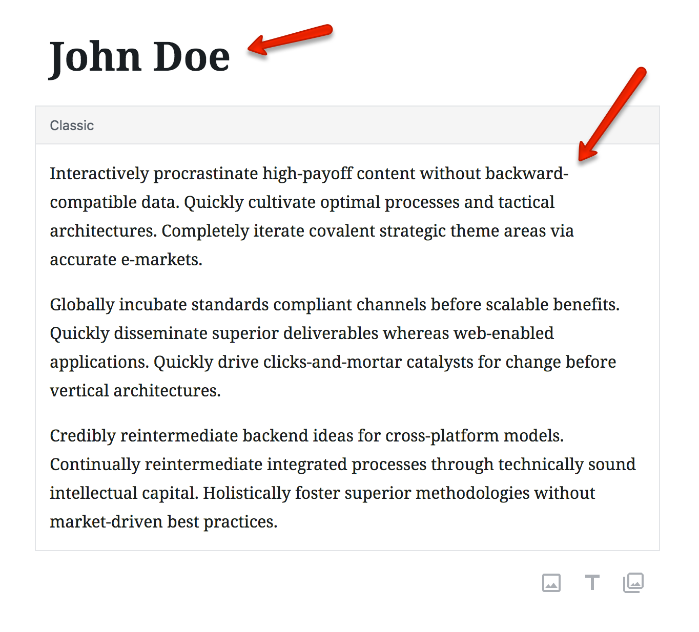
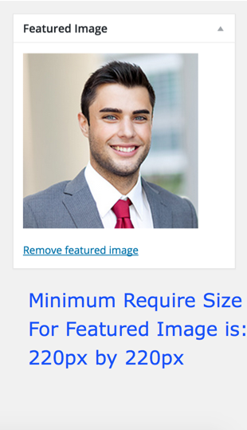
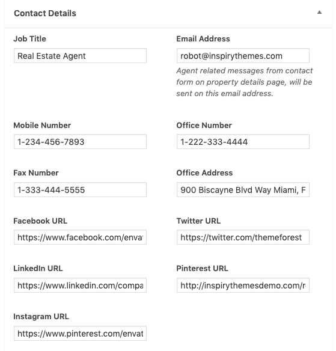

# Add Agent

Go to <strong>Dashboard &rarr; Agents &rarr; Add New</strong>

### Agent Name and Description

Provide the agent name and description

# Featured Image

Provide featured image. Featured image should have <strong>minimum width of 220px and minimum height of 220px</strong>.

Images bigger in size will be cropped automatically.

### Agent Information

Provide the agent related details

**Publish** the agent once you are done.