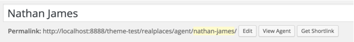
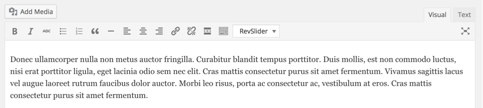

Go to <strong>Dashboard &rarr; Agents &rarr; Add New</strong>

Provide the agent name 

Provide the agent description 

Provide featured image. Featured image should have <strong>minimum width of 220px and minimum height of 220px</strong>.

Images bigger in size will be cropped automatically.

Provide the agent related details

Publish the agent once you are done.