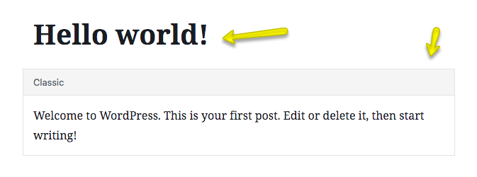
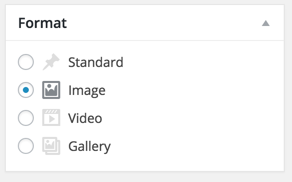
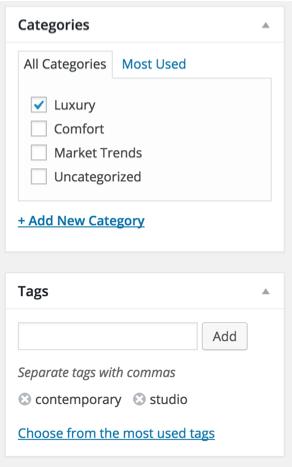
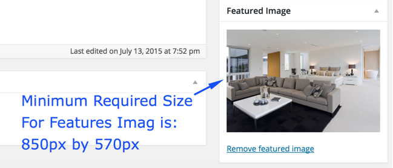

## 📰 Add News / Blog Post

To add a new blog post or news article, navigate to **Dashboard → Posts → Add New**

---

### 📝 Post Title & Content

Enter a clear and engaging **post title**, and write your post content in the main editor area.

---

### 🗂️ Post Format

Select the appropriate **Post Format** (e.g., Standard, Gallery, Video, etc.).

#### 🔍 Post Formats & Related Meta Boxes

The theme supports multiple post formats.  
Upon selecting a format, **related meta boxes** will appear below the editor. Make sure to:

- Fill out those fields properly
- Add any required media or links

> 🎯 This ensures your post is displayed in the best layout style matching its content type.

---

### 🏷️ Select Category & Tags

Choose or create a relevant **category** and add appropriate **tags** to help organize your content.

---

### 🖼️ Featured Image

Upload a **featured image** for your post.

- Minimum size: **850px × 570px**
- Larger images will be **automatically cropped** to fit

> 📌 A high-quality featured image helps grab attention and is used across blog listings and widgets.

---

### ✅ Final Step

Once you’ve added all the required content and settings, click **Publish** to make your post live.

> You can always return to **Posts → All Posts** to edit or update your content later.