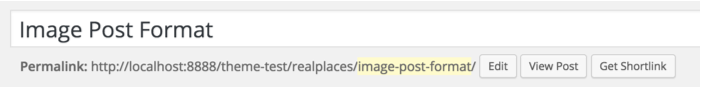
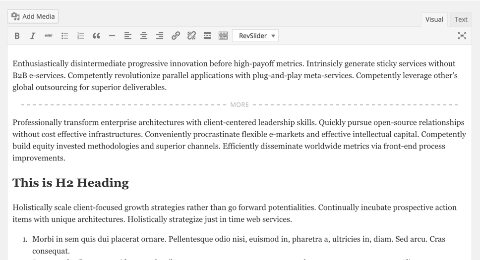

Go to <strong>Dashboard</strong> &rarr; <strong>Posts</strong> &rarr; <strong>Add New</strong>

Provide the post title 

Select the related post format 

<strong>Post Formats and Related Meta Boxes:</strong>

This theme supports various post formats. So, when you select a post format look out for related meta boxes that will appear after your selection. You need to fill out those meta boxes with related information, so that your post can appear in best possible design.

Write post contents 

Add or select related category and tags

Provide featured image. Featured image should have minimum width of 850px and minimum height of 570px.

<strong>Images bigger than minimum required size will be cropped automatically.</strong>

Publish the post once you are done.
