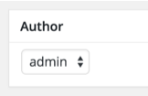
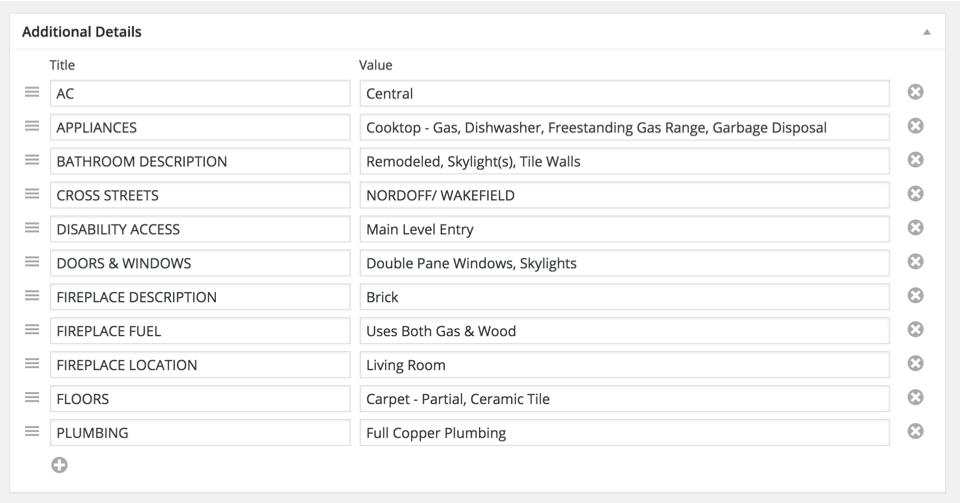
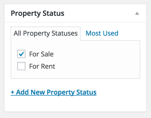
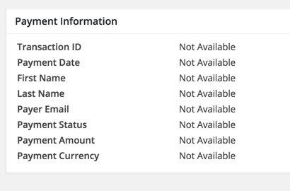

## 🏠 Add a New Property

To add a new property, go to **Dashboard → Properties → Add New**

---

### 📝 Property Title & Description

Enter a clear and descriptive **title** and provide detailed information about the property in the **description** field.

---

### 🔢 Basic Information

Fill in essential details like **price**, **area**, **bedrooms**, **bathrooms**, **garages**, etc.

---

### 📍 Map Location

Set the property’s location:

- Enter the address or Drag the map marker to the exact location.
- Optionally set a **zoom level** (integer value).
- Leave the address field **blank** to hide the map on the property detail page.

---

### 🖼️ Property Gallery

Upload gallery images for the property using the media uploader.

---

### 🎥 Virtual Tour

Provide a **virtual video tour** link or embed code if available.

---

### 👤 Agent Information

Choose how the property’s author/agent is displayed:

#### 📌 Understanding the Difference: Author vs Agent

From the visitor's perspective, both look the same.

From the admin's perspective:

- **Author**: A registered site user (with at least Author role) who adds a property from the dashboard or front-end submission page.
- **Agent**: A separate post type that can be created by users with sufficient privileges and assigned to properties.

> This flexible setup allows you to display whichever makes more sense for your use case.

| Option | Behavior |
|--------|----------|
| **None** | Hides the agent/author box |
| **Author Information** | Displays details of the user who added the property (editable via profile page) |
| **Agent's Information** | Displays the selected agent’s profile |

You can also change the author from the **Author meta box** on the property edit screen.

---

### ⚡ Energy Performance Certificate

Fill in the **Energy Performance Certificate** fields if available.  
A visual energy class graph will display this on the frontend.

---

### 🌟 Mark Property as Featured

Enable the **Featured Property** option if this property should appear in featured listings.  
You can also:

- Attach downloadable files
- Add **private notes** (not shown to visitors)

---

### 🖼️ Add to Homepage Slider

To include this property in the homepage slider:

- Set the toggle to **Yes**
- Upload a **Slider Image** as required

---

### 🏞️ Top Banner Settings

Upload a **custom banner image** for the property if needed.

---

### 📋 Additional Details

Add extra details relevant to the property using the **Additional Details** meta box.

---

### ✂️ Property Excerpt

If the main description isn’t suitable for previews, provide a custom **excerpt**.

---

### 📷 Property Featured Image

Upload a **featured image** with dimensions at least **850x600 pixels**.  
This is required and used in listings and detail pages.

---

### 🏷️ Property Type

Select an existing **property type** or create a new one.

---

### 🚦 Property Status

Select or create a **property status** (e.g., For Sale, For Rent, etc.)

---

### 📍 Property Location

Choose an existing or add a new **property location**.

> If you're using **hierarchical locations**, select the **lowest level child** – the parent(s) will be assigned automatically.

---

### ✔️ Property Features

Select or add **features** that apply to the property (e.g., Swimming Pool, Garden, etc.)

---

### 🧩 Child/Sub Property

If this property is part of another (like an apartment in a building), assign it as a **child property** to a parent property.

---

### 💳 Property Payment Information

If your site uses paid property listings, related payment details will appear in this section for **paid listings**.

---

### ✅ Final Step

Once you’ve completed all the relevant sections, click **Publish** to make your property live.

> You can edit the property anytime later to update its content or settings.