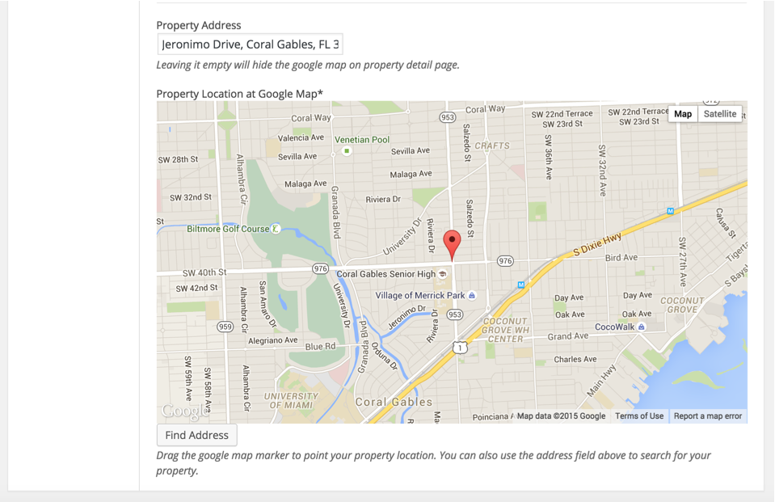
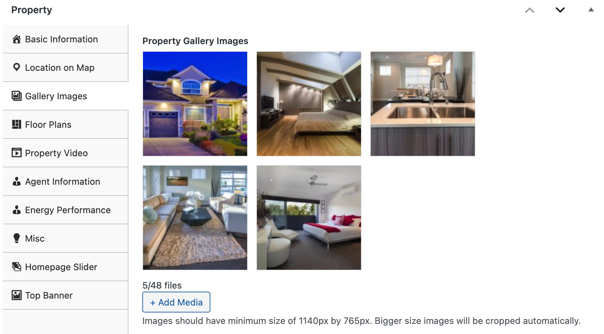
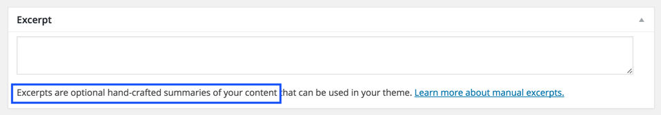
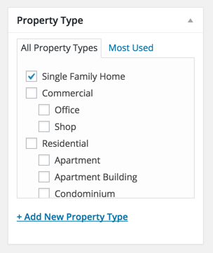
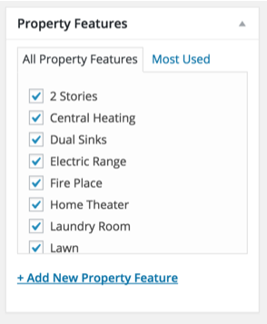

Go to <strong>Dashboard &rarr; Properties &rarr; Add New</strong>

### Provide Property Title and Description

### Basic Information

Provide property basic information like price, area, beds, baths and garages etc. 

### Location Information
Provide property location information on google map. 
<strong>Leave the address field empty to hide the map on property detail page.</strong> 

### Property Gallery

Provide property gallery images if any 

### Virtual Tour

Provide property virtual video if available 

### Agent Information

Provide property agent information. 

<strong>Difference Between Author Information and Agent's Information</strong>

From website visitor point of view there is no difference and information from both will be displayed in similar way.

From website admin point of view, An author is basically a site user that logins and add a property using admin side, If his role is author or above OR add a property from front end property submission page.

An agent is a custom post type and any user with role equal or above author role can add those agents and later on assign properties to those agents.

So, basically it is a flexible feature that can be used in a way that fulfills your needs.

<strong>None</strong> will hide the agent's information box.
<strong>Author information</strong> will display the Author( user who added the property ) information.
 You can configure your user information from edit profile page ( Please check related documentation section for details of setting up front end edit user profile page).
 If you have adequate rights, You can also modify the author from <strong>Author</strong> meta box on property edit page. 

<strong>Display agent's information</strong> will display the selected agent's information.

### Mark Property as Featured

If you want to add this property into featured properties then mark this property as featured. 
You can provide any file attachments you want to share with visitor. 
You can keep some private notes about this property as private notes will not be displayed anywhere else. 

### Add Property to Home Page Slider

If you want to add this property in homepage slider then you need to choose <strong>Yes</strong> for field displayed in the screen shot below and provide slider image as required by <strong>Slider Image</strong> field below it.  

### Top Banner Settings

If you are interested in using a custom banner image for this property then you can upload that using banner image upload field displayed in the screen shot below. 

### Additional Details

 You can provide additional details about a property using related meta box displayed in the screen shot below.

### Property Excerpt

 If you feel like regular description is not good enough to be displayed as excerpt then you can add your own hand crafted excerpt using related meta box displayed in the screen shot below.

### Property Featured Image

 You need to upload a featured image for every property and make sure it's size is equal or greater than <strong>850px by 600px</strong> 

### Property Type

 Choose a property type if already exists or add new one that properly represents your property.

### Property Status

 Select a property status if already exists or add new one that properly represents your property.

### Property Location

 Select a property location if already exists or add new on that properly represents your property.

If you are using hierarchical locations then make sure to choose the one at the lowest level ( lowest level child ) and parents will be considered automatically.

### Property Features

 Choose the applicable property features if already exists or add new one that are important for your property.

### Child/Sub Property

 If you are selling a property that is a child/sub property of another property that is also in market for sale or rent then you can connect two properties in a parent child relationship using met box displayed in the screen shot below.

### Property Payment Information

 If you are taking payments for your properties then related payment information for paid properties will be displayed in a meta box that is displayed in the following screen shot.

So, Provide that information related to your property using all the options described above and Publish it once you are done.
