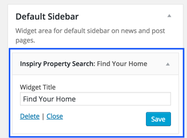

Go to <strong>Appearance</strong> &rarr; <strong>Widgets</strong> and look for <strong>Inspiry Property Search</strong> widget.

Use this widget in a sidebar and provide it's title.

Now check out the front end of your site and you will have the <strong>Properties Search Widget</strong> working for your site. It's appearance and functionality depends upon the settings your provided in
<strong>search form configurations.</strong> You can visit the "Search Setup" section of this documentation to explore those configurations.

