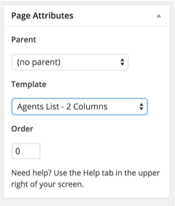
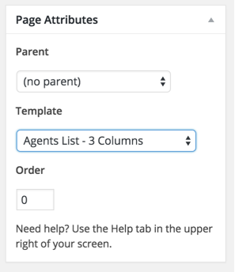
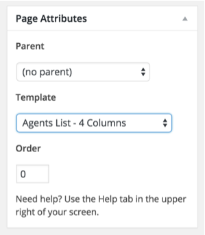
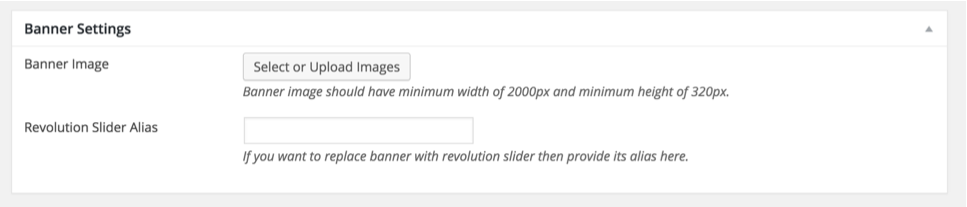

In case of <strong>Demo Contents Import</strong> agents pages are already created and you do not need to follow this section.

Go to <strong>Dashboard &rarr; Pages &rarr; Add New</strong> and provide a page title that suit your purpose.

Select the appropriate template from page attributes. As examples are displayed in 3 screen shots below.

If you want to change the default banner then you can do that from <strong>Banner Settings</strong> meta box displayed in the screen shot below.

You can <strong>Publish</strong> the page once it is ready.

After publishing you need to add the newly created page in menu from <strong>Dashboard</strong> &rarr; <strong>Appearance</strong> &rarr; <strong>Menus</strong>
