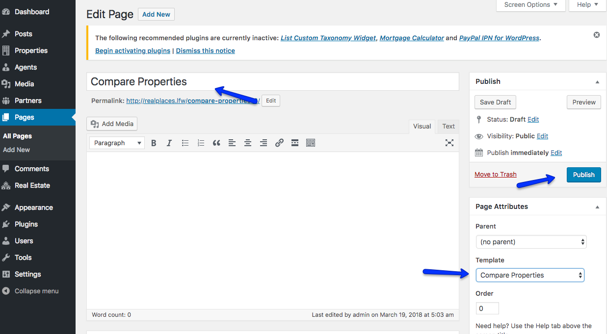
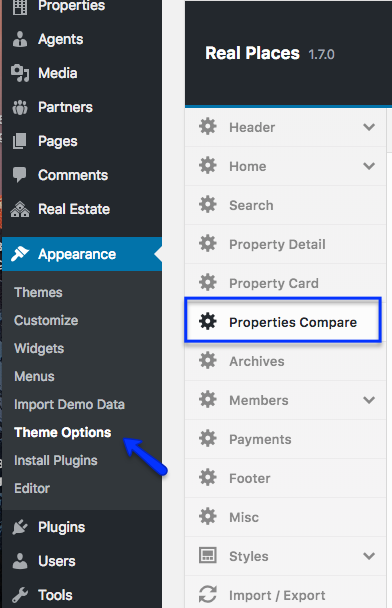
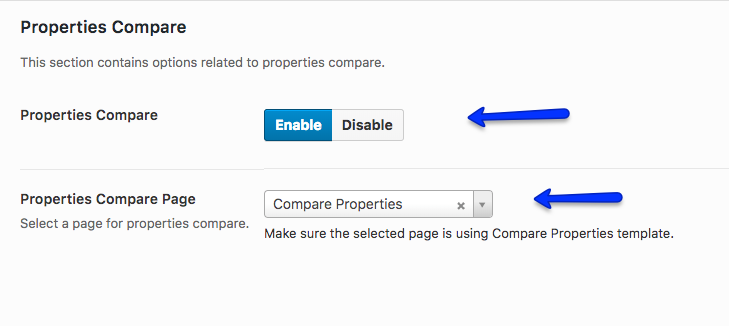

### Create Compare Properties Page

Go to <strong>Dashboard → Pages → Add New</strong> and provide a page title. Select <strong>Compare Properties</strong> template and click <strong>Publish</strong> button to publish the page.

### Compare Properties Settings

Go to <strong>Appearance → Theme Options → Properties Compare</strong> for settings.

You can <strong>Enable/Disable</strong> the Properties Compare feature.

Select The page that we have created earlier using <strong>Compare Properties</strong> template.

Save settings and Compare Properties feature is ready to use.