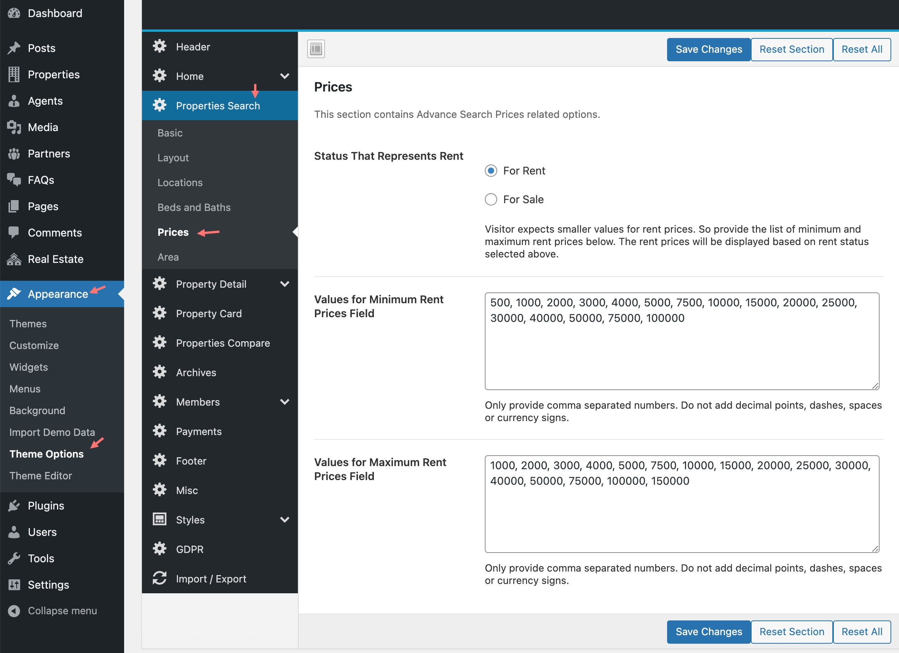

These configuration will affect properties search form in following  places on your website.

1. **Both variations of properties search form on home page.**
2. **Properties search form widget for sidebar.**

### Properties Search Page Settings

### Properties Search Form Settings

To configure properties search form, Go to <strong>Appearance</strong> &rarr; <strong>Theme Options</strong> &rarr; <strong>Search</strong>, As displayed in the screen shot below.

### Property Features Checkboxes
On all other occurrences of search forms you can show or hide property features checkboxes to filter search results.
<strong>Note:</strong> This is not for search form in home page header.

### Drag &amp; Drop Fields Manager
You can control the search fields you want to display and their order of appearance, Using the drag &amp; drop fields manager displayed in the screen shot below.

### Location Field's Customizable Option
Location field is flexible to display 1 to 4 location select boxes.

If you want to display all locations in one select box, Select <strong>1</strong> and provide related title.

Select <strong>2</strong> if you want to display locations like <strong>City &rarr; Area</strong> OR <strong>State &rarr; City</strong>. Make sure to provide related titles.

Select <strong>3</strong> if you want to display locations like <strong>Country &rarr; State &rarr; City</strong> OR <strong>State &rarr; City &rarr; Area</strong>

Select <strong>4</strong> if you want to display locations like <strong>Country &rarr; State &rarr; City &rarr; Area</strong>

### Min &amp; Max Price Fields Values
You can change the minimum and maximum price fields values to your needs.
Only provide comma separated numbers. Do not add decimal points, dashes, spaces or currency signs.

You can also add the minimum and maximum price values for the properties which are available for rent.

### Search Results Page and It's Header
You can choose the search results page to which the form will send it's data to get search results. You need to visit he previous section to learn how to create a search results page.

Now, You can choose what type of header a search results page can have. As displayed in the screen shot below.

### Search Results Page Configuration
You can choose the number of properties to display on search results page and the type of layout you want search results page to have. You can also choose the default order of search results. It is recommended to keep it sorted by date new to old.

you can choose layout from six search page layouts

