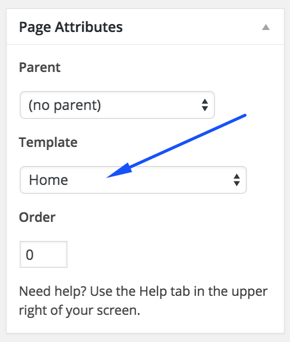
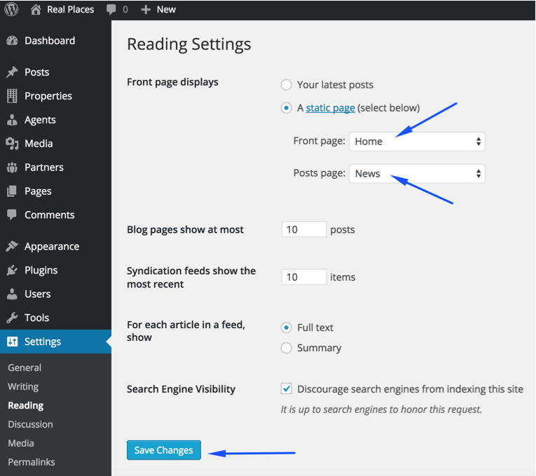
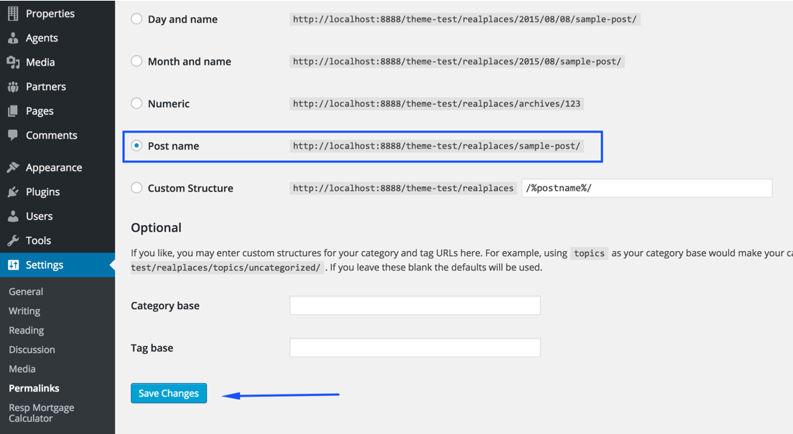
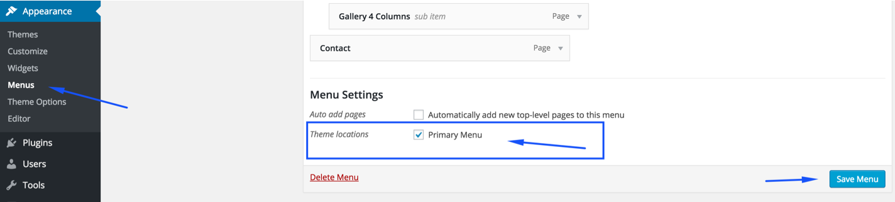

In case of <strong>Demo Contents Import</strong> the home page and news page are already created and you do not need to follow this section.

### Create Home Page

To create Home page you need to create a new page, Go to <strong>Pages</strong> &rarr; <strong>Add New</strong>. You can give this page a title &quot;Home&quot; yet you do not need to include any contents for now. Select the “Home” template from the Page Attributes section, as displayed in the screen shot below and click <strong>“Publish”</strong>.

### Create News Page

To create News page you need to create a new page, Go to <strong>Pages</strong> &rarr; <strong>Add New</strong>. You can give this page a title &quot;News&quot; yet you do not need to include any contents. Select the “Default Template” template from the Page Attributes section and click <strong>“Publish”</strong>.

### Configure Reading Settings

Now you need to configure reading settings, Go to <strong>Dashboard</strong> &rarr; <strong>Settings</strong> &rarr; <strong>Reading</strong> and choose the front page displays as static page. Then select Home as Front Page and News as Posts Page. As, displayed in the screen shot below.

### Configure Pretty Permalinks

 To configure pretty permalinks, Go to <strong>Dashboard</strong> &rarr; <strong>Settings</strong> &rarr; <strong>Permalinks</strong> and change it as displayed in the screen shot below.

 

### Configure Primary Menu

Navigate to <strong>Appearance</strong> &rarr; <strong>Menus</strong> and create a new menu with any name you like. Assign the newly created menu to theme location "**Primary Menu**" from <strong>Menu Settings</strong> section below menu. After that save the menu. As pointed in the screen shot below.

 