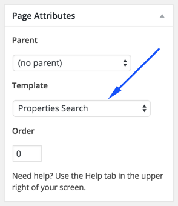
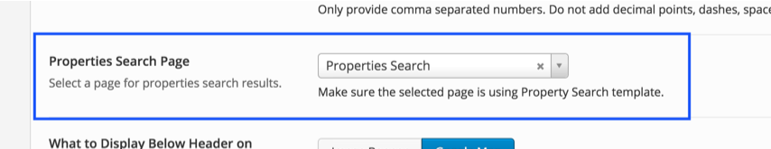

In case of <strong>Demo Contents Import</strong> the search results page is already created and you do not need to follow the 1st part of this section. You can follow the 2nd part in case of manual demo content import.

### Part 1

To create properties search results page you need to create a new page. Go to <strong>Pages</strong> &rarr; <strong>Add New</strong> and give this page a title &quot;**Properties Search**&quot;, you do not need to include any contents. Select the “Properties Search” template from the Page Attributes section, as displayed in the screen shot below and click <strong>“Publish”</strong>.

<Strong>Note:</Strong> Make sure the name of search page does not conflict with
<a target="_blank" href="https://codex.wordpress.org/Reserved_Terms">WordPress reserved terms</a>.

### Part 2

After publishing properties search results page you need to go to <strong>Appearance</strong> &rarr; <strong>Theme Options</strong> &rarr; <strong>Search</strong> ( As displayed in the screen shot below ).

Select this newly created page in related theme option. As displayed in the screen shot below.

Now, Properties search form will submit it's data to this newly created properties search results page.
