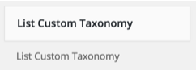
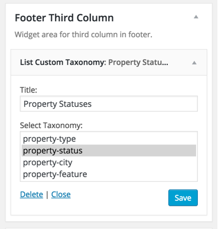
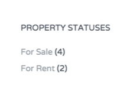

You need <a target="_blank" href="https://wordpress.org/plugins/list-custom-taxonomy-widget/">List Custom Taxonomy</a> plugin for this widget. It is a recommended plugin and chances are, That you have already installed it during theme install.

Go to <strong>Appearance</strong> &rarr; <strong>Widgets</strong> and look for <strong>List Custom Taxonomy </strong> widget.

Use this widget in a sidebar or footer widget area and configure related details.

Now check out the front end of your site and you will have the <strong>List Custom Taxonomy Widget</strong> working for your site.

