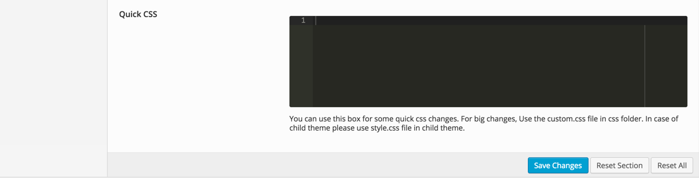
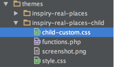
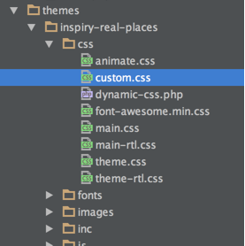

There are various options available to modify theme styles.

<strong>Theme Options</strong> - Go to <strong>Dashboard</strong> &rarr; <strong>Appearance</strong> &rarr; <strong>Theme Options</strong> &rarr; <strong>Styles</strong> for various styles related sections.

<strong>Quick CSS</strong> - Go to <strong>Dashboard</strong> &rarr; <strong>Appearance</strong> &rarr; <strong>Theme Options</strong> &rarr; <strong>Styles</strong> &rarr; <strong>Quick CSS</strong> to add small css changes.

<strong>Custom CSS in Child Theme</strong> - '<strong>child-custom.css</strong>' file is provided in child theme to add big css changes.

<strong>Custom CSS in Parent Theme</strong> - if you are not using child theme then '<strong>css/custom.css</strong>' file is provided in parent theme to add big css changes.

