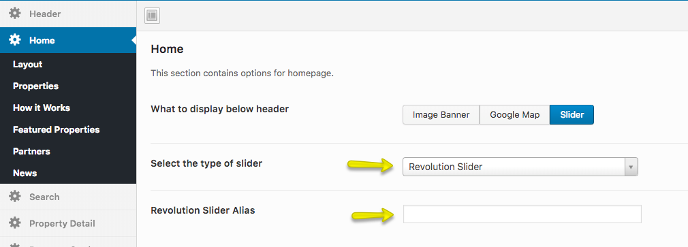

###Creating Slider

dsIDXpress IDX plugin is quite limited in terms of customizability and options to create elements such as dynamic slider so you can use Revolution Slider and add it's alias in Dashboard → Appearance → Theme Options → Home (as shown below).

### Shortcodes

dsIDXpress IDX plugin gives you a feature to create the shortcodes via 4 dsIDXpress IDX Shortcode options in Visual Editor.

### Adding IDX Content to Home Page

dsIDXpress IDX plugin provides multiple shortcodes as we mentioned above. So use the dsIDXpress IDX Shortcode option (shown in the screenshot below) in Visual Editor to insert the shortcode of your choice and options.

You can click on the dsIDXpress IDX Shortcode option to select the desired option for the content and then click on Insert Listing button to insert the shortcode to the post/page of your choice.