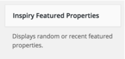
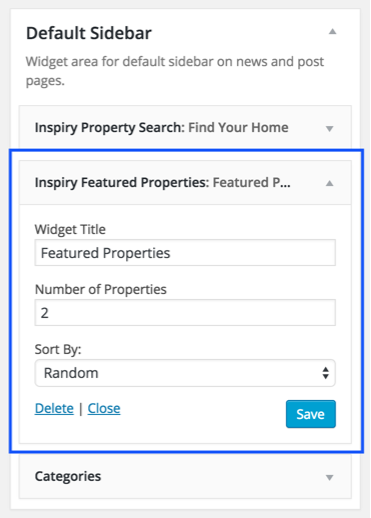
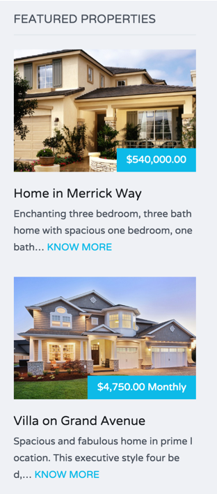

Go to <strong>Appearance</strong> &rarr; <strong>Widgets</strong> and look for <strong>Inspiry Featured Properties </strong> widget.

Use this widget in a sidebar and configure related details.

Now check out the front end of your site and you will have the <strong>Featured Properties Widget</strong> working for your site.

