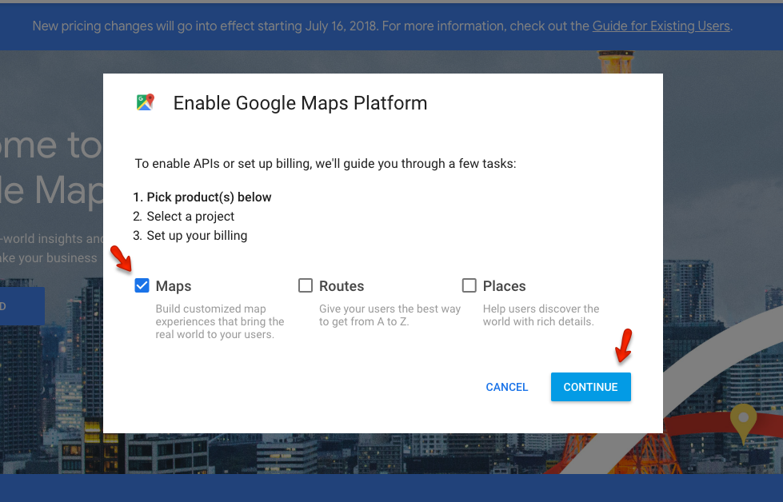
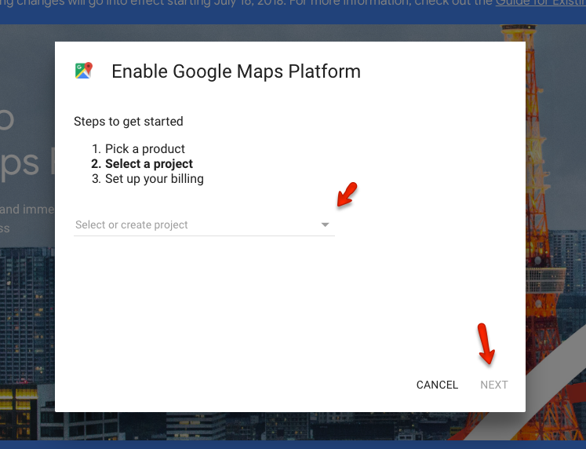
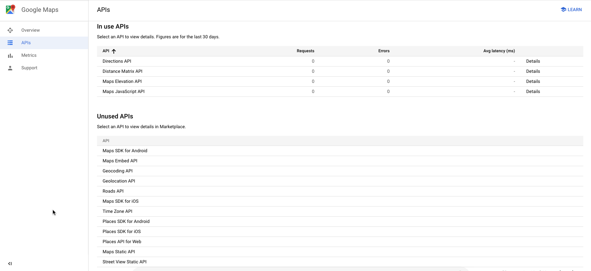
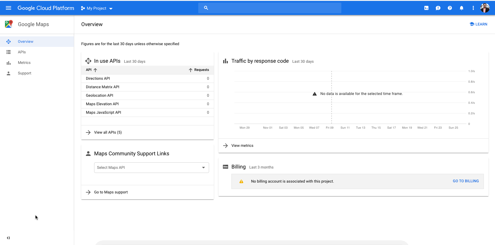
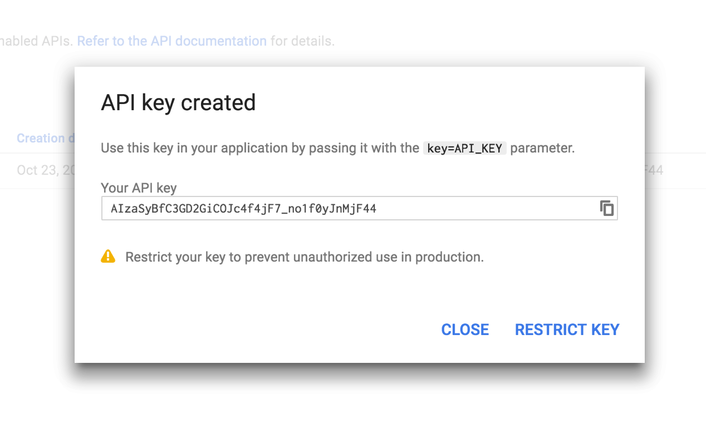
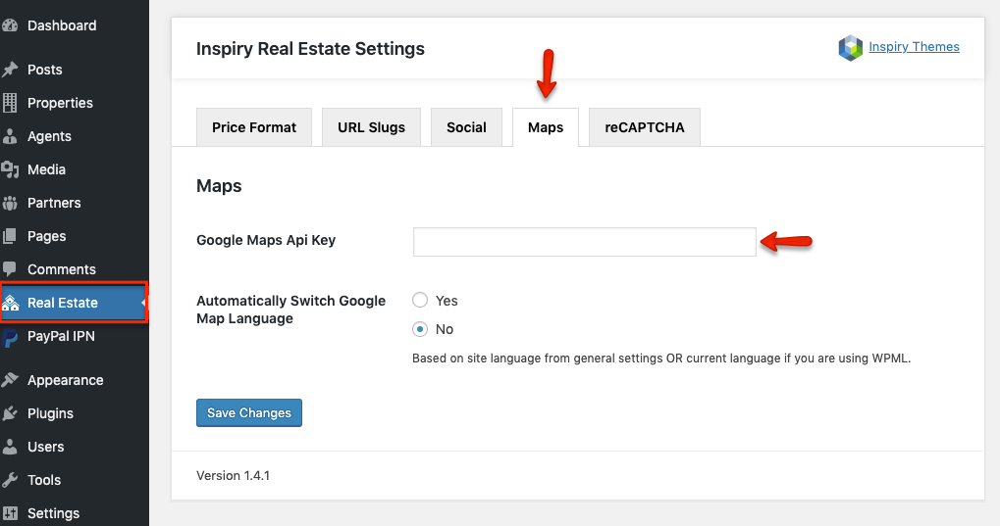

# How to get Google Maps API Key for your website

> As of June 2016, to keep Google Maps running smoothly on your website you need a special API Key. To get and setup the API Key for Google Maps please follow the instructions below. Google Maps is no longer free, and they moved it to the Google Cloud Platform. You now need to have a Google Cloud account with a credit card or bank account attached, so they can charge you if you exceed their free tiers.

1. Please go to [**Google API Console**](https://cloud.google.com/maps-platform/#get-started). and login with your google account. Once logged in it will display a popup so pick Maps from it.

2. Create a new project or select an existing project then click on **Continue** to enable the **API** and any related services.

3. On the next step you have to create a billing profile.

3. After creating the billing profile navigate to the Console and click on APIs from the right navigation.

4. On this new page, click on **Geocoding API** and **Enable** it for your project. This is also needed to make the **Find Address** field work properly on **Property Edit Page**. 

5. After activating **Geocoding API** click on the **Navigation Menu** and select **APIs & Services** and click on **Credentials**. In this section, you will see the name of your **API Key** (so click on it) and restrict it by adding your site URLs as shown in the screencast below.

6. Copy the generated **Google Maps API key** from the popup. Click on **Close** button to proceed after you copied the **API Key**. 

7. Put the copied **API Key** in **Dashboard → Real Estate → Maps**. 

**Verify Domain with Google**: [https://support.google.com/webmasters/answer/35179](https://support.google.com/webmasters/answer/35179)