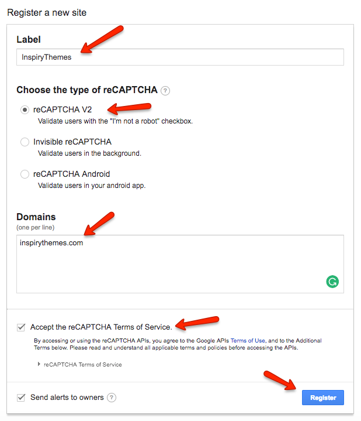
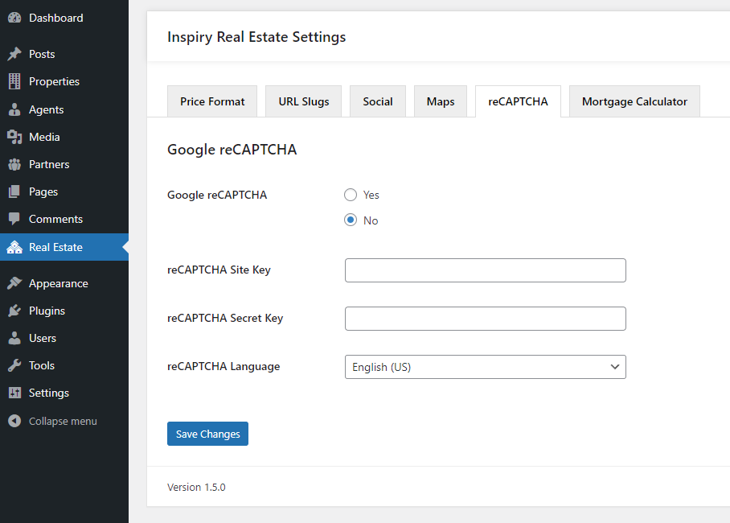

# Google reCAPTCHA

To configure **Google reCAPTCHA** you need to register your website at [Visit Google reCAPTCHA Site](https://www.google.com/recaptcha/intro/index.html) and get public and private keys for your website after successful registration. Please note that you must add the **URL of YOUR website** and select **reCAPTCHA V2** correctly otherwise the reCAPTCHA won't work. 

 

After that use those keys to fill the related fields in **Dashboard → Real Estate → reCAPTCHA** as displayed below.

