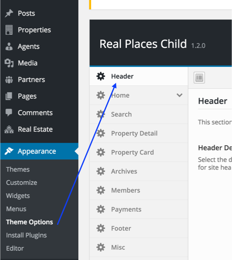
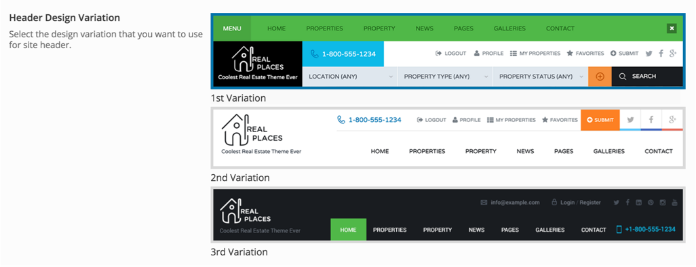
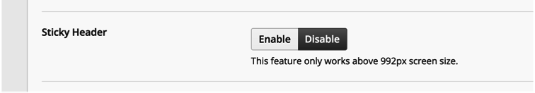
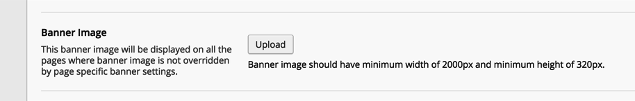
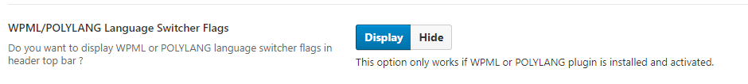
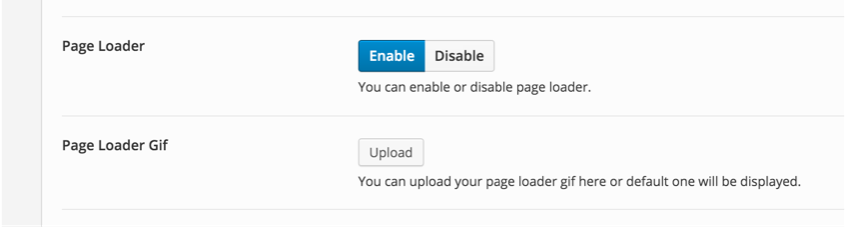

Navigate to <strong>Appearance</strong> &rarr; <strong>Theme Options</strong> &rarr; <strong>Header</strong> and you will find various options to customize header to your needs.

There are many options but few important ones are listed below.

You can change the header design variation.

You can make the header sticky.

You can change the header banner image. Banner image uploaded from this theme option is a global banner image that will be displayed on all the pages of your website except the ones that have specific banner image uploaded from meta box on their edit page.

You can show or hide wpml language switcher if you are using WPML plugin.

You can enable or disable page loader and even change the default loader to your own gif.

