You can display one of following three things below header on homepage.

- **Image Banner**
- **Google Map**
- **Slider** ( It can be one of following three types )
    - **Properties Slider**
    - **Properties Slider Two**
    - **Properties Slider Three**
    - **Revolution Slider**

Go to <strong>Appearance</strong> &rarr; <strong>Theme Options</strong> &rarr; <strong>Home</strong> to change what to display below header on homepage.

### Image Banner

Go to <strong>Appearance</strong> &rarr; <strong>Theme Options</strong> &rarr; <strong>Home</strong> and choose "Image Banner" as displayed in the screen shot below.

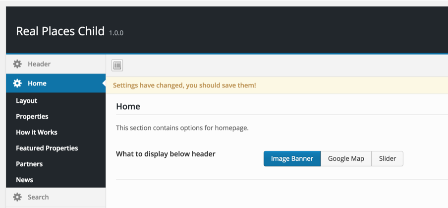

After saving these changes You can provide banner image specifically for home page, By editing home page and uploading banner image in it's banner image meta box as displayed in the screen shot below. Otherwise default banner image from header theme options will be displayed.

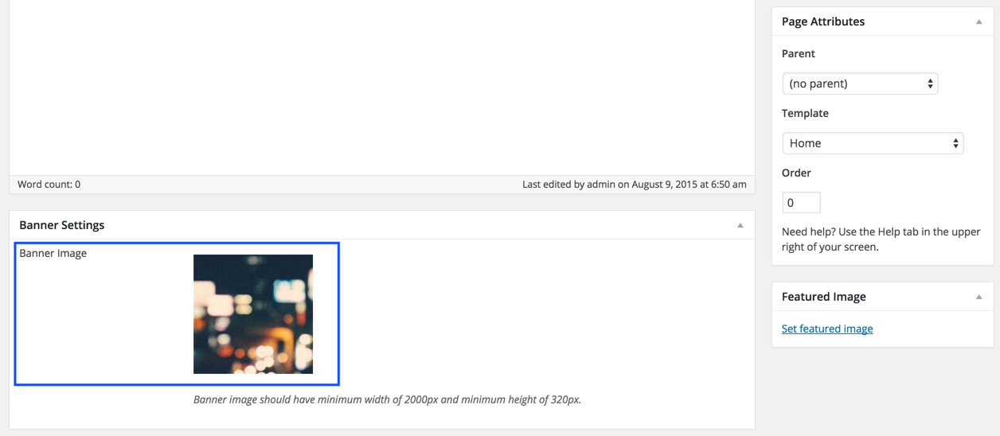

### Google Map

Go to <strong>Appearance</strong> &rarr; <strong>Theme Options</strong> &rarr; <strong>Home</strong> and choose "Google Map" as displayed in the screen shot below.

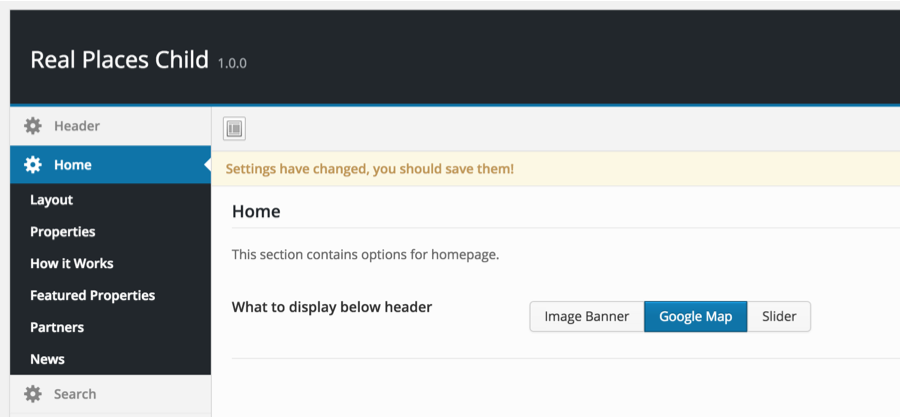

Google map will automatically adjust itself based on your provided properties locations.

### Slider

Go to <strong>Appearance</strong> &rarr; <strong>Theme Options</strong> &rarr; <strong>Home</strong> and choose "Slider" as displayed in the screen shot below.

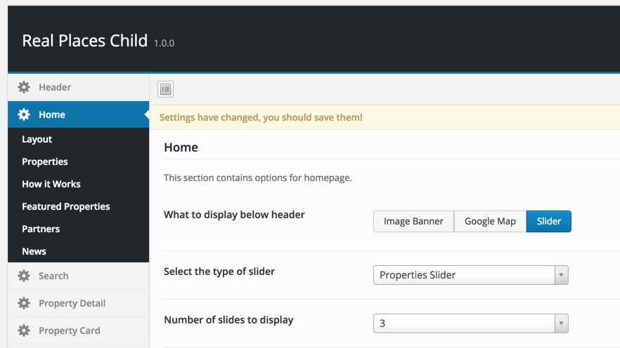

As mentioned earlier, Slider can be of following three types

- Properties Slider
- Properties Slider Two
- Properties Slider Three
- Revolution Slider

#### Properties Slider ( All )

As it's name suggests, Properties slider simply displays property information in slider. You can configure a property to appear in slider from it's edit page, using related meta box. As displayed in the screen shot below.

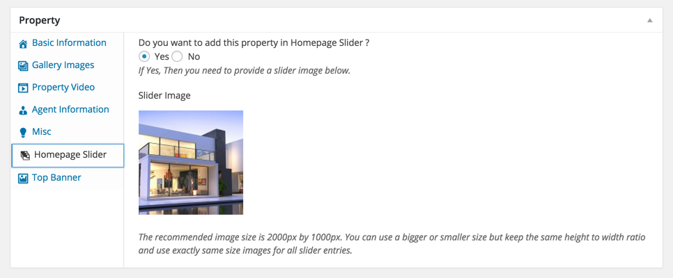

#### Revolution Slider

To use revolution slider you need to install "Slider Revolution" plugin. As displayed in the screen shots below.

1. Go to <strong>Plugins</strong> &rarr; <strong>Add New</strong> and click on "<strong>Upload Plugin</strong>".

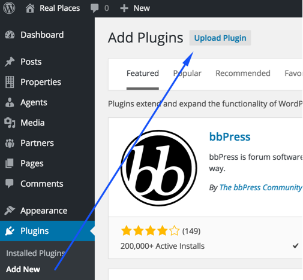

2. Look for the folder name <strong>Plugins/Revolution Slider</strong> in unzipped package downloaded from themeforest.net. This folder will contain revolution slider's plugin zip, documentation and demo slider import zip. You need to upload the <strong>revslider.zip</strong> as displayed in image below.

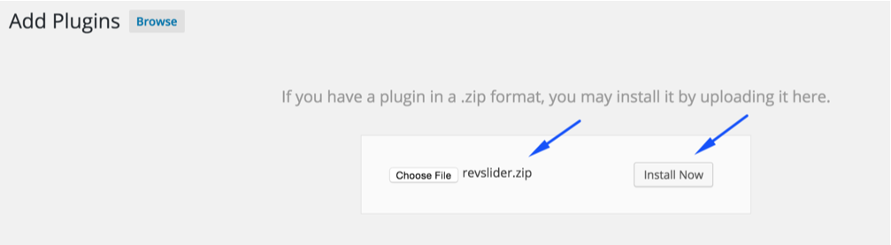

3. Activate the plugin after upload and install.

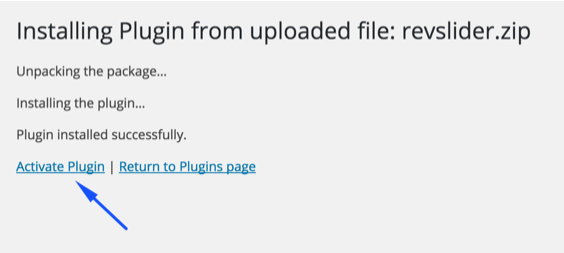

4. Go to <strong>Revolution Slider</strong> in the left sidebar and start importing sample slider.

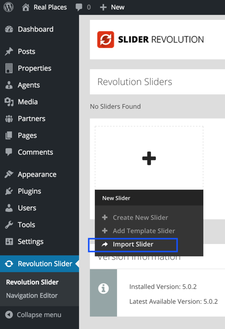

5. You need to choose the <strong>real-places.zip</strong> file from <strong>Plugins/Revolution Slider/real-places-slider</strong> folder.

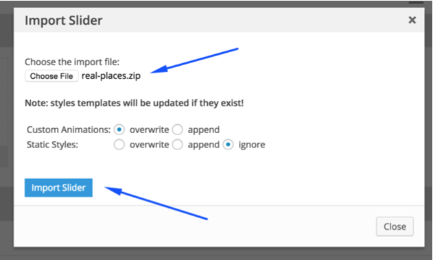

6. Once imported, You need to go to imported slider's edit page.
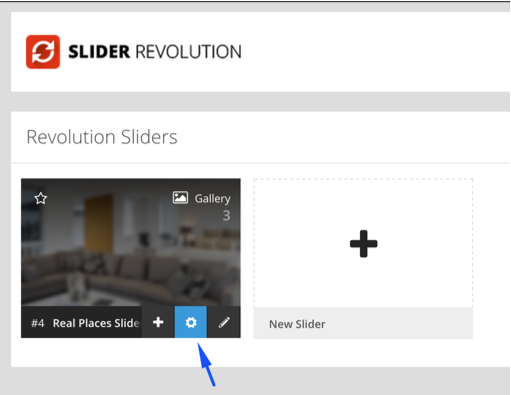

7. Copy it's alias, As pointed in the screen shot below.

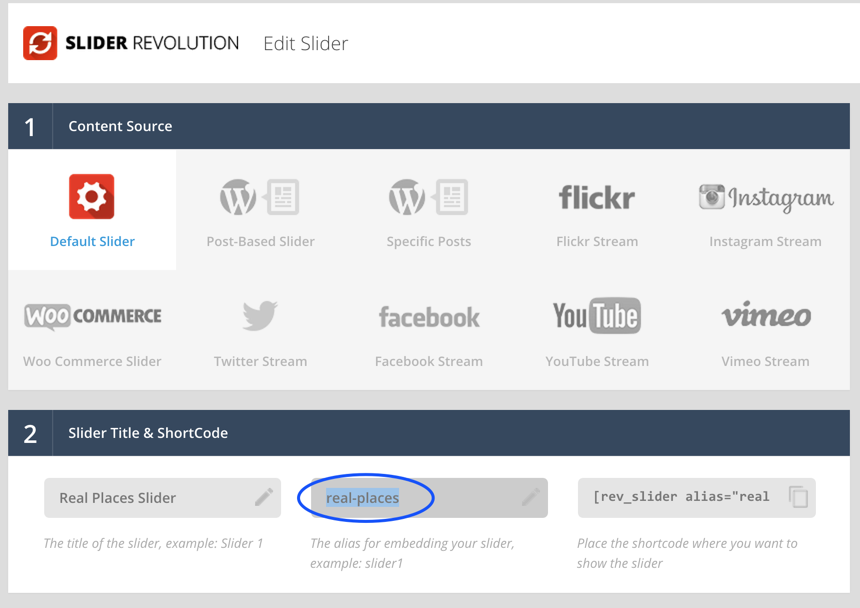

8. Paste the alias in theme options as displayed in the screen shot below.

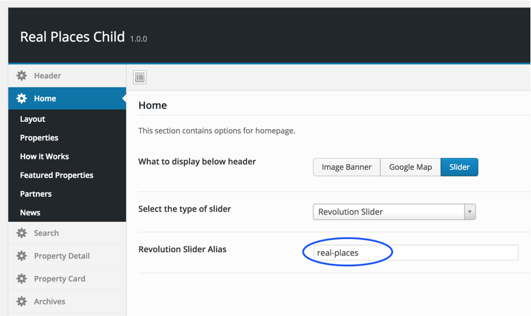

After this save the changes and view your homepage.

