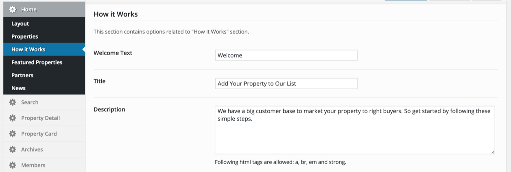
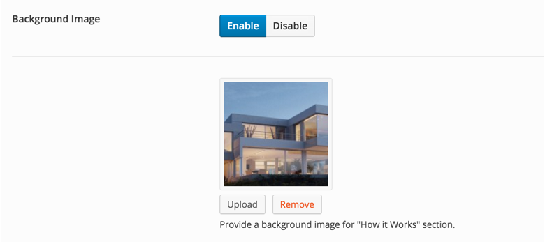
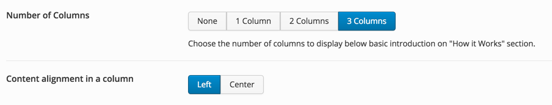
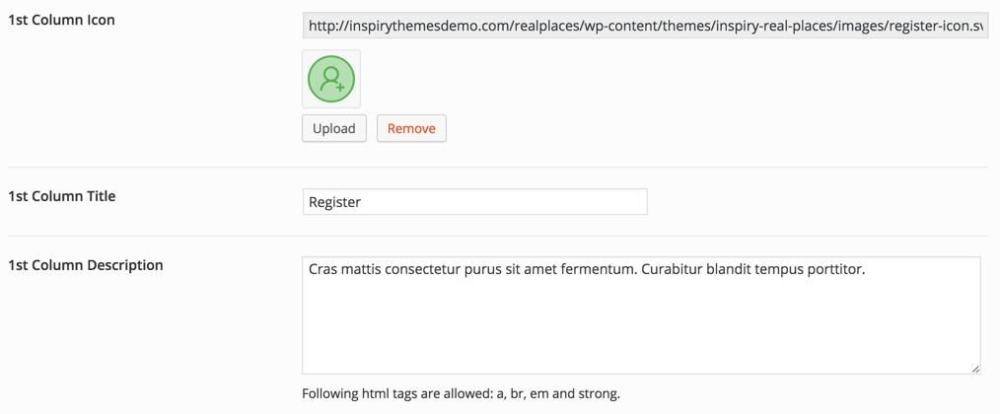
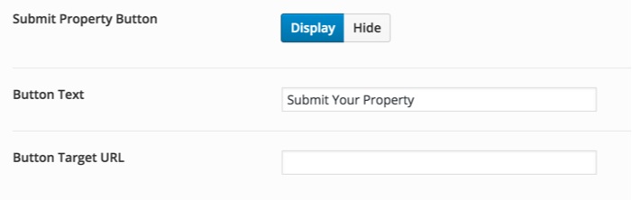

Home page provides a "**How It Works**" section, That you can use to explain some steps to visitor about using your website. 

To customize this section, Go to <strong>Appearance</strong> &rarr; <strong>Theme Options</strong> &rarr;  <strong>Home</strong> &rarr; <strong>How It Works</strong> and make the required configuration to fulfill your needs. All the options in this section are pretty self explanatory.

### Introduction Strings

### Background Image

### Possible Columns

### Column Data

### Submit Button

