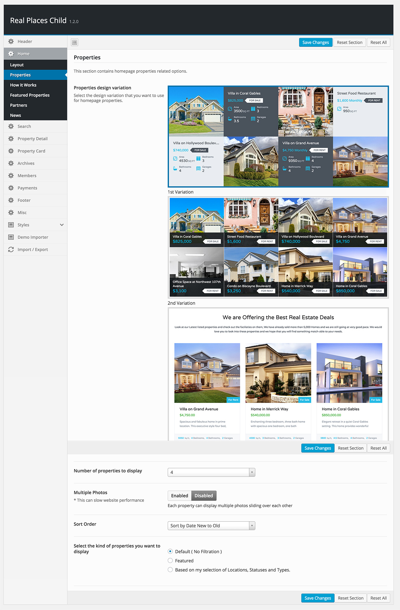

Properties on Home Page

Home page provides two design variations for properties section. 

To customize home page properties, Go to <strong>Appearance</strong> &rarr; <strong>Theme Options</strong> &rarr; <strong>Home</strong> &rarr; <strong>Properties</strong> and make the required configuration to fulfill your needs. Related screen shot is displayed below.

