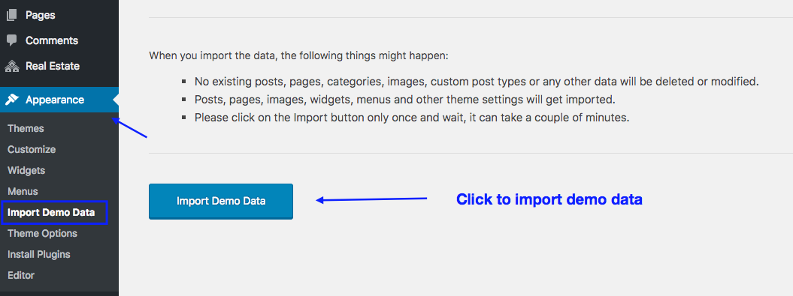
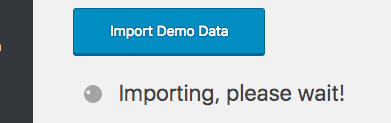
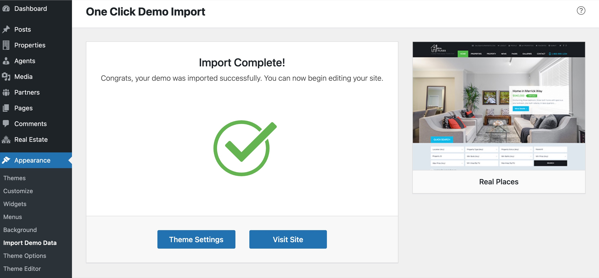
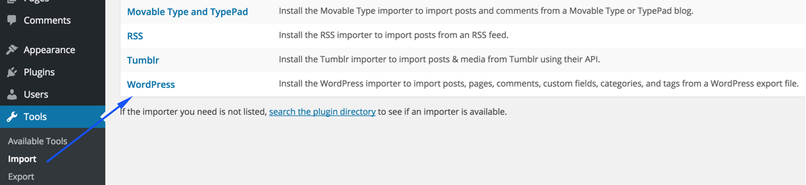
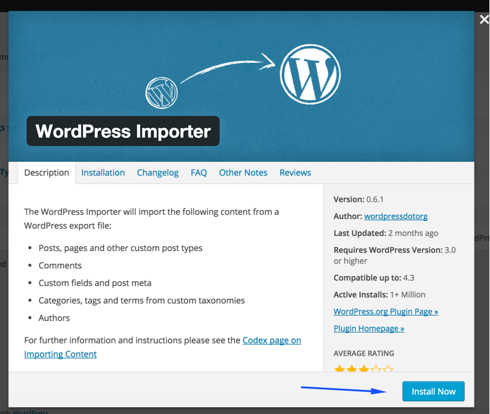
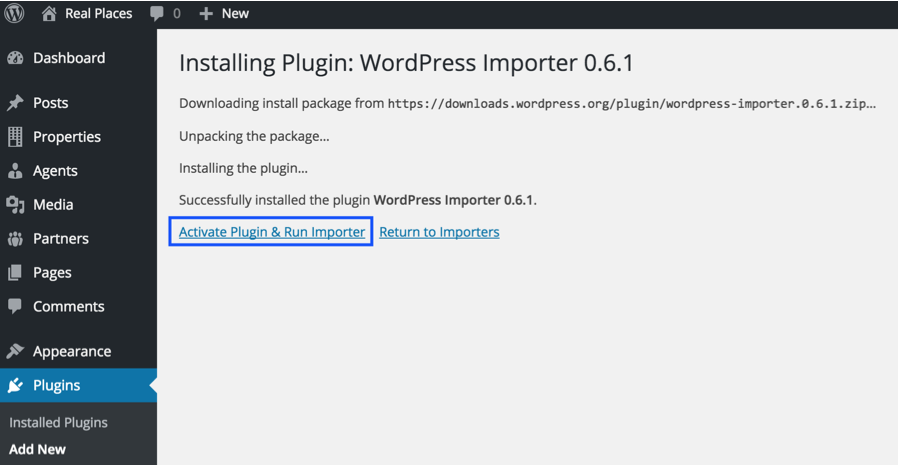
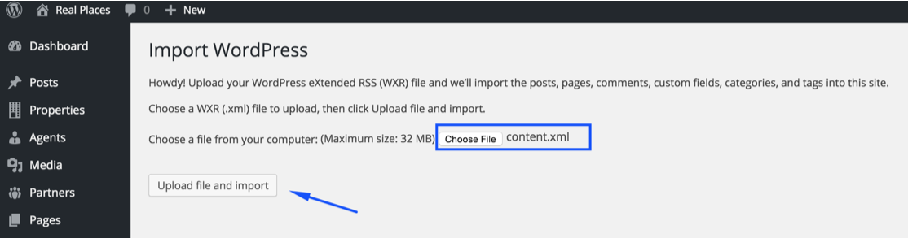
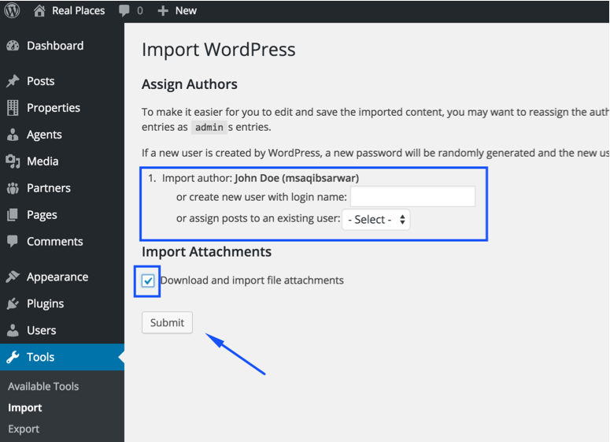

## 🌐 Import Demo Content

You can import demo content using one of the following methods:

1. **One-Click Demo Import** – *Automatic & Recommended*
2. **Manual XML Import** – *For advanced users or fallback cases*

---

## ⚡ One-Click Demo Import (Recommended)

### ✅ Step 1 – Configure Permalinks

Go to **Dashboard → Settings → Permalinks**, select **Post name** under *Common Settings*, and click **Save Changes**.

> 🔒 This step is critical as the property search system relies on pretty permalinks.

---

### 🚀 Step 2 – Start Import Process

Go to **Dashboard → Appearance → Import Demo Data**  
Click on the **Import Demo Data** button to begin, and on the next page click on **Continue & Import**.

> ⏳ **Please wait** while demo images and data are fetched from the remote server. This may take a few minutes depending on your connection and server speed.

---

### ✅ Step 3 – Done

Once the import completes, you’ll see a success screen.  
Visit your site and it should now look like the theme demo.

> 📝 **Note:** The imported content is a simplified version of the full demo to ensure faster import. It includes all necessary content but with fewer items.

---

## 🛠️ Manual XML Import (Alternative Method)

Use this method only if the one-click importer fails or you prefer manual setup.

---

### 📄 Step 1 – Install WordPress Importer

Go to **Dashboard → Tools → Import**  
Click **WordPress** at the bottom of the list.

You will be prompted to install the **WordPress Importer Plugin**.

After installation, click **Activate Plugin & Run Importer**.

---

### 📁 Step 2 – Upload XML File

1. Locate the `Import XML` folder inside your extracted theme package.
2. Choose either the `default-demo` or `fallback-demo` folder – both contain the same data but are hosted on different servers.
3. Upload the `content.xml` file.

During the import:

- Assign posts to an existing author
- Check the box to **Download and import file attachments**
- Click **Submit**

> ⚠️ The process may take a few minutes. Stay on the same browser tab until it finishes.

---

### 🧭 Step 3 – Setup Navigation Menu

Go to **Dashboard → Appearance → Menus**

1. Select the menu that was imported with the demo content.
2. Assign it to the **Primary Menu** location under *Menu Settings*.
3. Click **Save Menu**.

---

### 🏠 Step 4 – Configure Reading Settings

Go to **Dashboard → Settings → Reading**

- Set **Your homepage displays** to **A static page**
- Set **Homepage** to *Home*
- Set **Posts page** to *News*

---

### 🔁 Step 5 – Configure Permalinks Again

It’s a good idea to revisit **Dashboard → Settings → Permalinks**  
Ensure **Post name** is selected and save again.

---

### 🎛️ Import Theme Options & Widgets (Optional)

To complete your setup:

- Import **theme-options.txt** for theme settings.
- Import **widgets.wie** for sidebar and footer widgets.

You’ll need this plugin to import widgets:  
🔌 [Widget Importer & Exporter](https://wordpress.org/plugins/widget-importer-exporter/)

---

✅ Once done, your site should closely match the demo and be ready for customization!