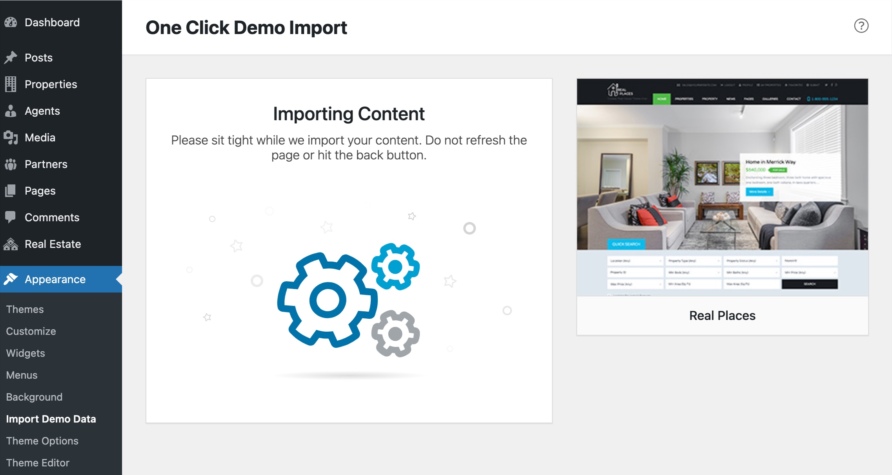
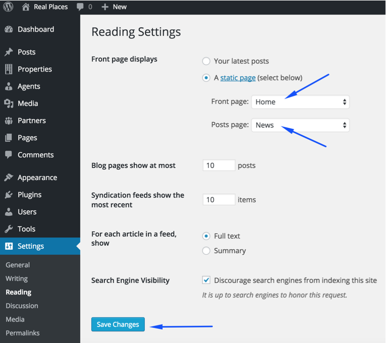

You can follow one of these choices.

<strong>One Click Demo Import</strong> ( Automatic & Recommended )
<strong>Import XML Contents and Configure the Theme Manually</strong>

One Click Demo Import ( Automatic & Recommended )

**Step 1**

Go to <strong>Dashboard</strong> &rarr; <strong>Settings</strong> &rarr; <strong>Permalinks</strong> and choose <strong>Post name</strong> from <strong>Common Settings</strong> and save the changes, As displayed in the screen shot below.

**Step 2**

Note: It is important to complete <strong>Step 1</strong> as property search is programmed to work with pretty permalinks. Otherwise you might face some issues after demo import.

Go to <strong>Dashboard</strong> &rarr; <strong>Appearance</strong> &rarr; <strong>Import Demo Data</strong> and click on <strong>Import Demo Data</strong> button .

After clicking the <strong>Import Demo Data</strong> button, <strong>Wait for few minutes</strong> as the demo images are being fetched from remote server and this process can take few minutes.

**Step 3**

Once the import process is complete, You will see a screen like the one below. Visit your site and you will find your site working like the theme demo.

<strong>Note:</strong> The number of imported posts, pages, properties and other stuff is smaller than real demo to make the import process reasonably fast. Otherwise it can be a problem for most users to import demo data.

Import XML Contents and Configure the Theme Manually

**Step 1**

Go to <strong>Dashboard</strong> &rarr; <strong>Tools</strong> &rarr; <strong>Import</strong> and click <strong>WordPress</strong> as displayed in image below.

First of all, you need to install <strong>WordPress Importer Plugin</strong>

Once installed, you need to activate the plugin and run the importer.

**Step 2**

Look for <strong>Import XML</strong> folder in unzipped package downloaded from themeforest. There will be two sub-folders in <strong>Import XML</strong> folder,
"default-demo" and "fallback-demo" both contains same stuff but hosted on different servers.
You can use the <em>content.xml</em> from any of these folders to import demo contents.

After importing file, Assign posts to an existing author. Mark the checkbox to download and import file attachments and Click 'Submit' button.

Import process can take few minutes. So wait for it and try to keep the focus on current tab in your browser.

After that is done, you will have bunch of posts, pages, properties and other contents imported into your WordPress installation.

**Step 3**

Navigate to <strong>Dashboard</strong> &rarr; <strong>Appearance</strong> &rarr; <strong>Menus</strong> and use the Already Imported Menu from XML and assign it to theme location "<strong>Primary Menu</strong>" from <strong>Menu Settings</strong> section below menu. After that save the menu. As pointed in the screen shot below.

**Step 4**

To configure reading settings you need to visit <strong>Dashboard</strong> &rarr; <strong>Settings</strong> &rarr; <strong>Reading</strong> and choose that front page displays as static page. Then select Home as Front Page and News as Posts Page. As, displayed in the screen shot below.

<strong>Next Step is to Configure Permalink Settings</strong>

**Step 5**

 To configure permalinks settings visit <strong>Dashboard</strong> &rarr; <strong>Settings</strong> &rarr; <strong>Permalinks</strong> and change it as displayed in the screen shot below.

 Now, All the remaining settings are mostly in theme options and plugin options. You can import theme options using <strong>theme-options.txt</strong> and widgets using <strong>widgets.wie</strong> with
<a target="_blank" href="https://wordpress.org/plugins/widget-importer-exporter/">Following Plugin</a>. 