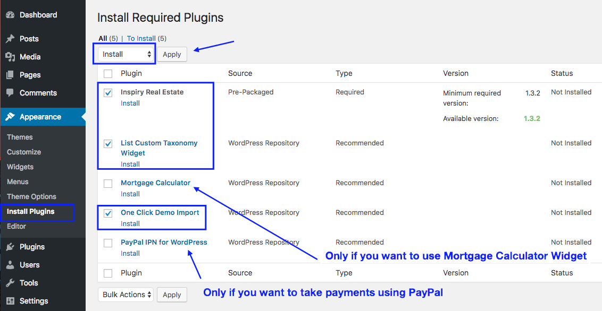
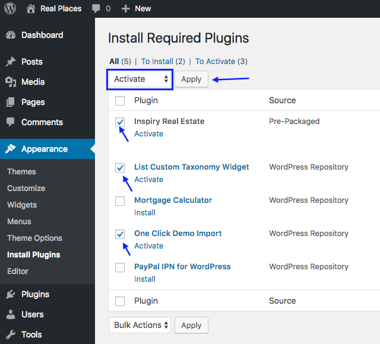

In start, You must have a working version of WordPress already installed. For information in regard to installing the WordPress CMS, please see the WordPress Codex <a target="_blank" href="https://codex.wordpress.org/Installing_WordPress">Installing WordPress</a> especially the <a href="https://wordpress.org/about/requirements/" target="_blank">Requirements</a>.
Once you have a working version of WordPress, you need to download <a data-lightbox="all-files" href="assets/common-images/all-files.png">All files and documentation</a> from themeforest and extract the downloaded zip to get various files including <strong>inspiry-real-places.zip</strong>.

### Install Theme Via WordPress Dashboard

1. Go to <strong>Dashboard</strong> &rarr; <strong>Appearance</strong> &rarr; <strong>Themes</strong> section
2. Click <strong>Add New</strong>' and select the '<strong>Upload Theme</strong> option

3. Choose the <strong>inspiry-real-places.zip</strong> file and press **Install Now**

4. Once the theme is uploaded you need to go back to themes page without activating it as it is recommended to use the <strong>child theme</strong> and now we will upload it.

5. Follow step 2 again and Choose the <strong>inspiry-real-places-child.zip</strong> file and press <strong>Install Now</strong>

6. Once the child theme is uploaded you can activate it.

Activating the theme will take you to the themes page.

if you face any problem during upload through dashboard, please upload the theme using FTP as guided below.

### Install Theme Via FTP - (Alternative)

1. Access your hosting server using an FTP client like <a target="_blank" href="https://filezilla-project.org/">FileZilla</a>.
2. Go to the '<strong>wp-content</strong>/<strong>themes</strong>' folder of your WordPress installation.
3. Extract the <strong>inspiry-real-places.zip</strong> file and put the <strong>inspiry-real-places</strong> folder in 'wp-content/themes/' folder.
4. After that extract the <strong>inspiry-real-places-child.zip</strong> file and put the <strong>inspiry-real-places-child</strong> folder in 'wp-content/themes/' folder.
5. Go to '<strong>Dashboard</strong> &rarr; <strong>Appearance</strong> &rarr; <strong>Themes</strong>' section to activate the Real Places child theme.

Activating the theme will take you to the themes page.

### Install Required Plugins

- After you have installed and activated the Real Places child theme. Go to <strong>Dashboard</strong> &rarr; <strong>Appearance</strong> &rarr; <strong>Themes</strong> there'll be a message of required & recommended plugins at the top of the Dashboard.

- Click on <strong>Begin Installing Plugins</strong> and it will take you to <strong>Dashboard</strong> &rarr; <strong>Appearance</strong> &rarr; <strong>Install Plugins</strong>

- Now, <strong>Install</strong> the plugins as demonstrated in the screen shot below.

- After installation, you will view a screen like below, Return to required plugins installer.

- Now <strong>Activate</strong> all the plugins as demonstrated in the screen shot below.

- After activating required plugins, Go to <strong>Inspiry Real Estate</strong> plugin settings and save them for 1st time. As guided in screenshot below.

Once all of the above is <strong>Done</strong>. The next step is to <strong>Import Demo Contents</strong>.