## 🧱 Getting Started

Before installing the theme, you must have a **working WordPress installation**.  
If you haven't installed WordPress yet, please refer to the official guides:

- 📘 [Installing WordPress – WordPress Codex](https://codex.wordpress.org/Installing_WordPress)
- ⚙️ [Server Requirements](https://wordpress.org/about/requirements/)

Once WordPress is set up and running, download the **All Files & Documentation** package from ThemeForest and extract the ZIP file.  
Inside, you'll find the following:

- `inspiry-real-places.zip` — Main theme file  
- `inspiry-real-places-child.zip` — Child theme file  
- Documentation, licensing info, and more

📸 Sample Folder Structure  
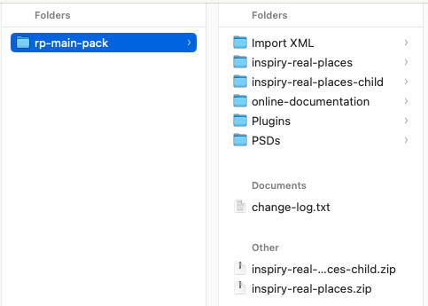

---

## 📥 Theme Installation via WordPress Dashboard

1. Go to **Dashboard → Appearance → Themes**
2. Click **Add New**, then select **Upload Theme**
   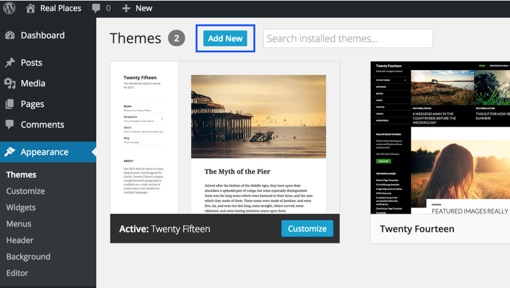
   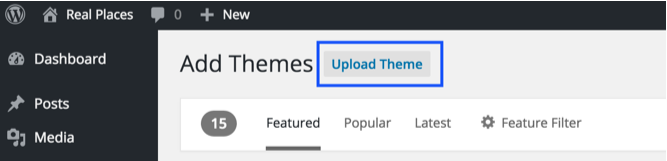
3. Upload the `inspiry-real-places.zip` file and click **Install Now**
   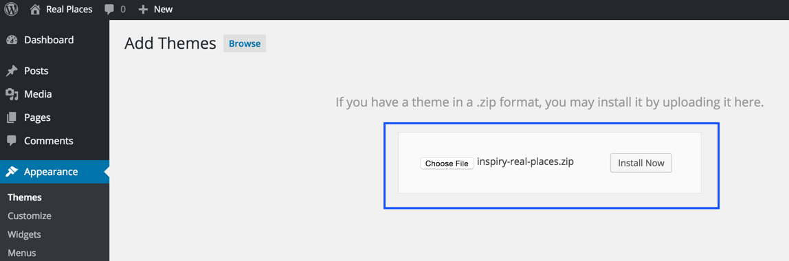
4. After the theme uploads successfully, **do not activate it yet**.  
   Instead, return to the **Themes** screen to install the **child theme**.
   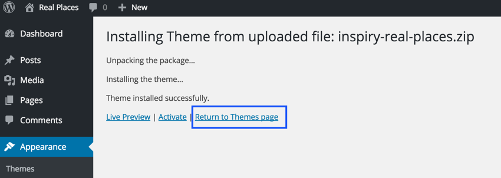
5. Repeat Step 2, this time uploading `inspiry-real-places-child.zip`, and click **Install Now**
   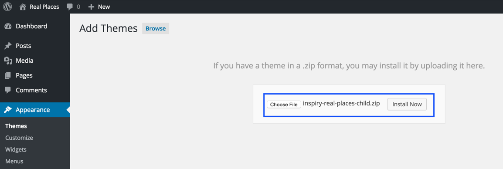
6. Once the child theme is uploaded, go ahead and **Activate** it
   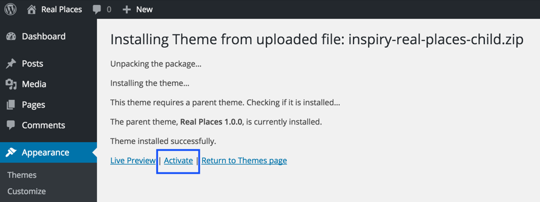

> 🎯 Always use the **child theme** to ensure your customizations remain intact after theme updates.

If you encounter any issues uploading via the dashboard, follow the FTP method below.

---

## 🌐 Theme Installation via FTP (Alternative)

1. Use an FTP client like [FileZilla](https://filezilla-project.org/) to access your website's files.
2. Navigate to the `wp-content/themes/` directory of your WordPress installation.
3. Extract `inspiry-real-places.zip` and upload the extracted folder to the `themes` directory.
4. Similarly, extract and upload the `inspiry-real-places-child.zip` to the same location.
5. Go to **Dashboard → Appearance → Themes** and activate the **Real Places Child Theme**.

> ✅ After activation, you’ll be redirected to the themes page.

---

## 🔌 Install Required Plugins

Once the **Real Places Child Theme** is activated:

1. A notice will appear at the top of the dashboard recommending required and optional plugins.
   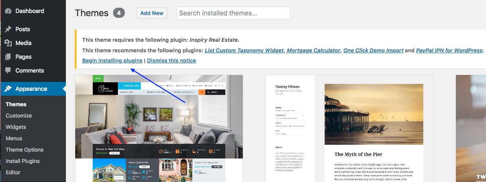

2. Click **Begin Installing Plugins**.  
   This will take you to **Dashboard → Appearance → Install Plugins**.
   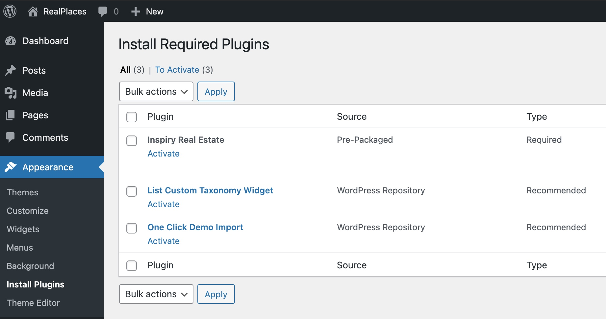

3. Select and **Install** all the recommended plugins.
   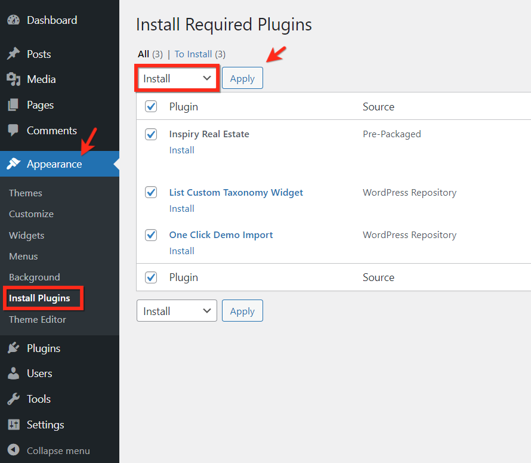

4. After installation, click the option to **Return to Required Plugins Installer**.
   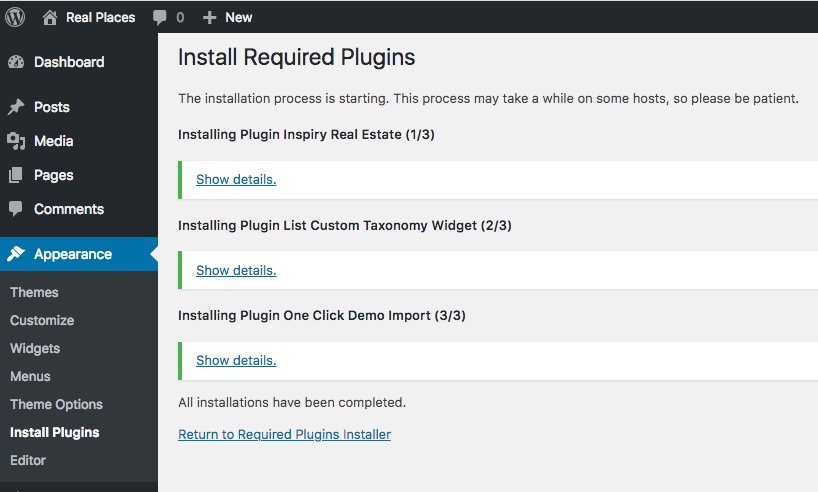

5. Now, **Activate** all the installed plugins.
   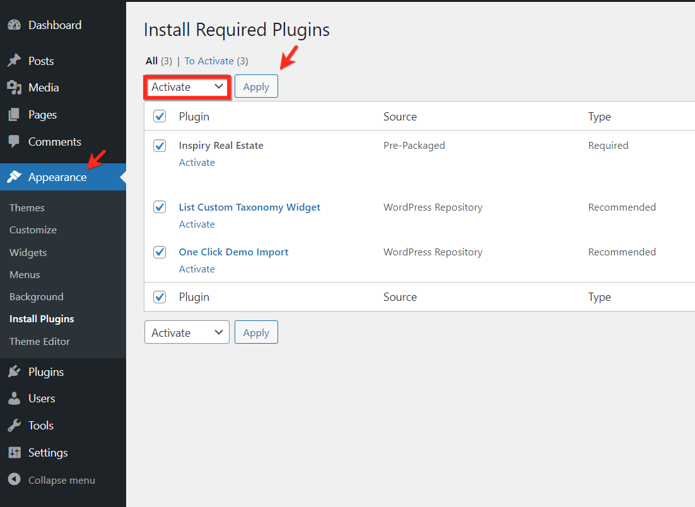

6. Finally, go to **Dashboard → Inspiry Real Estate → Settings** and click **Save Changes** once to initialize default settings.
   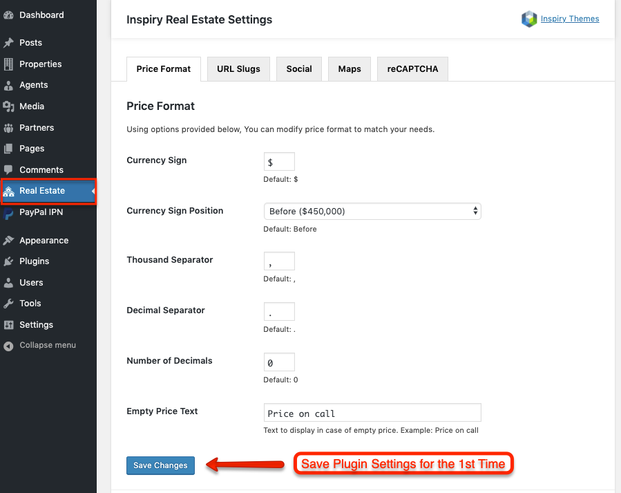

---

✅ Once all of the above steps are complete, you are ready for the next step:  
👉 **[Importing Demo Content](http://documentation.inspirydemos.com/realplaces/import-demo-contents/)**