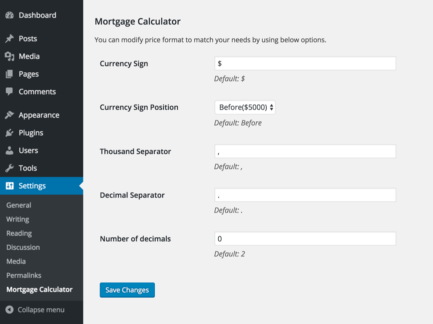
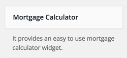
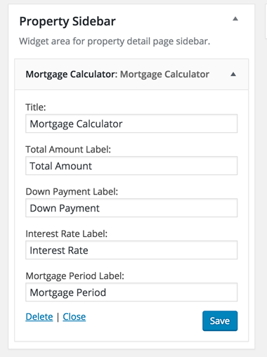
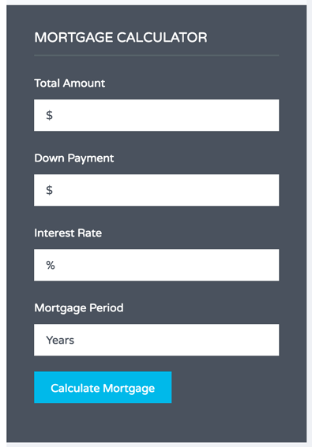

You need <a target="_blank" href="https://wordpress.org/plugins/mortgage-calculator/">Mortgage Calculator</a> plugin. It is a recommended plugin and chances are, That you have already installed it during theme install.

You can configure it's settings from <strong>Settgins</strong> &rarr; <strong>Mortgage Calculator</strong>

Go to <strong>Appearance</strong> &rarr; <strong>Widgets</strong> and look for <strong>Mortgage Calculator </strong> widget.

Use this widget in property sidebar and provide it's title.

Now check out property detail page front end and you will have the <strong>Mortgage Calculator Widget</strong> working for your site.

