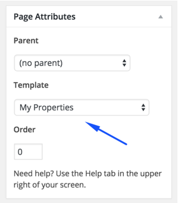
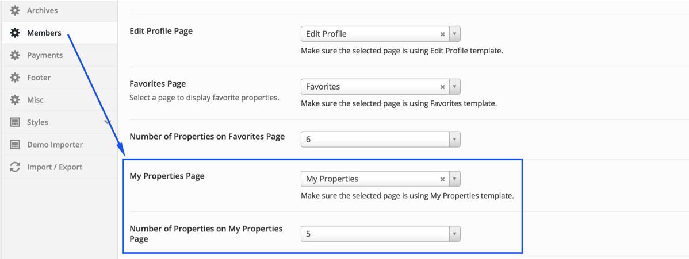

In case of <strong>Demo Contents Import</strong> my properties page is already created and you do not need to create it but make sure to follow point 5 and 6 in this section.

To add my properties page, Go to <strong>Dashboard</strong> &rarr; <strong>Pages</strong> &rarr; <strong>Add New</strong>

Provide "My Properties" as page title ( You can provide any page title you want )

Select <strong>My Properties</strong> template from page attributes as displayed in the screen shot below.

<strong>Publish</strong> the page once you are done.

Now you need to go to <strong>Appearance</strong> &rarr; <strong>Theme Options</strong> &rarr; <strong>Members</strong> and choose the newly created page as my properties page. As displayed in the screen shot below.

Save the changes in theme options and <strong>My Properties</strong> page is ready for use.
