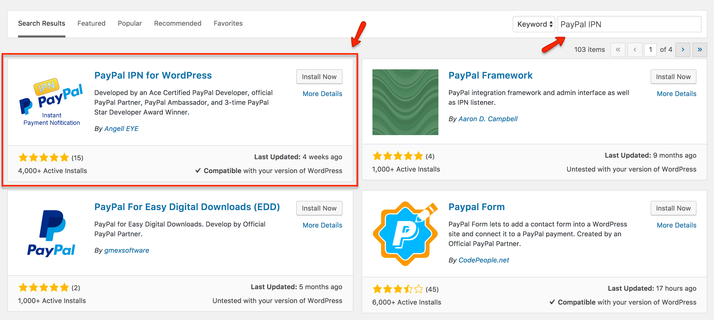

You can install and setup <strong><a href="https://wordpress.org/plugins/paypal-ipn/" target="_blank">PayPal IPN Plugin</a></strong> for payment functionality.

Please navigate to <strong>Dashboard</strong> &rarr; <strong>Plugins</strong> &rarr; <strong>Add New</strong> and search for <strong>"PayPal IPN"</strong> as shown in the screenshot below:

Once you have found it then click the <strong>"Install Now"</strong> link under the PayPal IPN for WordPress plugin in the list of results.
Click the <strong>"Activate Plugin"</strong> link after the plugin has been installed.

## PayPal IPN Plugin Setup
To setup your WordPress <strong>PayPal IPN listener</strong> you will need to copy your IPN URL from the plugin’s general settings tab into your PayPal account profile’s IPN settings panel.

Kindly navigate to <strong>Dashboard</strong> &rarr; <strong>Settings</strong> &rarr; <strong>PayPal IPN</strong>.
Highlight the <strong>PayPal IPN Primary URL</strong> and copy it to your clipboard by pressing <strong>Ctrl+C / Cmd+C</strong>.
If you wish to enable logging for troubleshooting purposes, check the box and click <strong>Save</strong> as shown in the screenshot.

Login to your <strong>PayPal account</strong>.
Click the <strong>Profile</strong> link on the <strong>My Account</strong> tab.
Click <strong>Instant Payment Notification Preferences</strong> in the <strong>Selling Preferences</strong> section.
Click <strong>Choose IPN Settings</strong>.
Enter your <strong>IPN URL</strong> that you copied from the plugin settings.
Click <strong>Receieve IPN messages (Enabled)</strong> to activate your IPN listener.
Click <strong>Save</strong> to save your changes.

