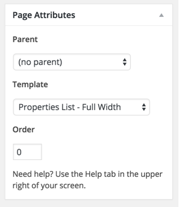
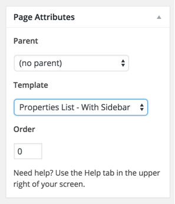
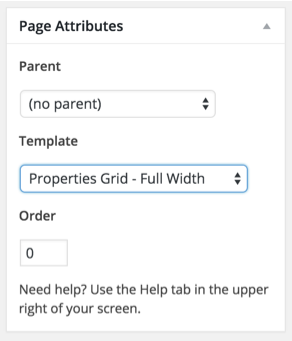
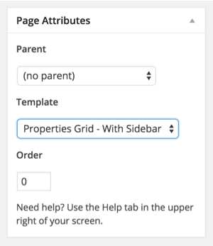
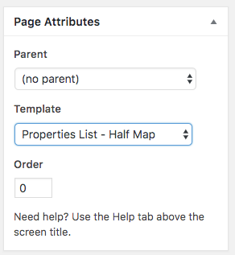
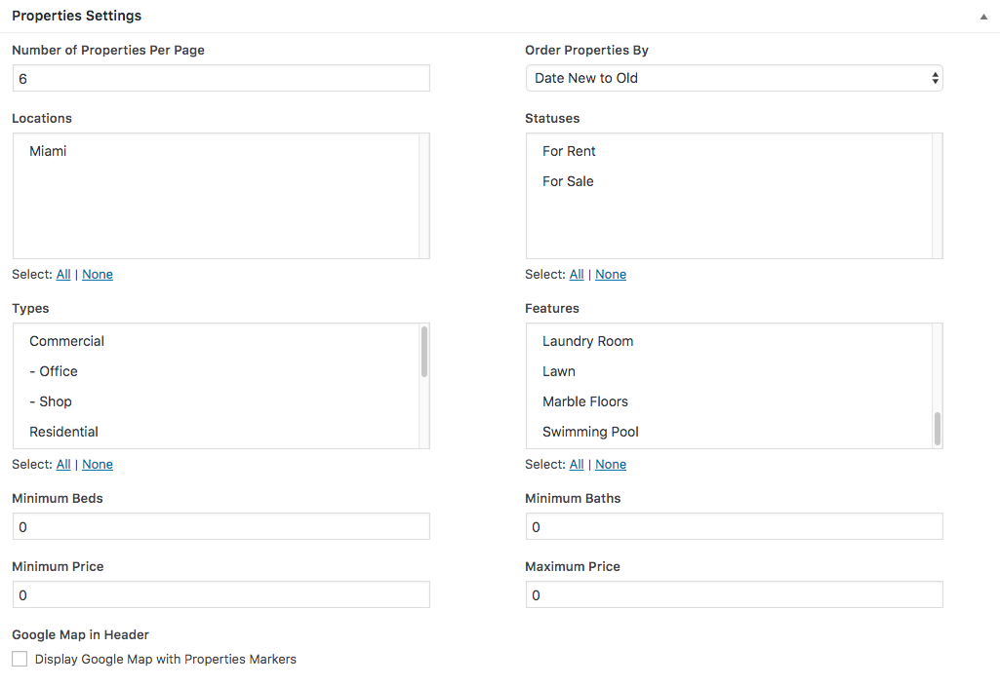
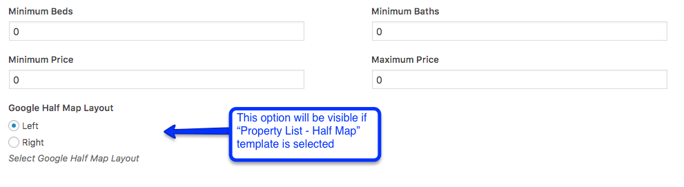

Go to <strong>Dashboard</strong> &rarr; <strong>Pages</strong> &rarr; <strong>Add New</strong> and provide a page title that suit your purpose.

Select the appropriate template from page attributes. As examples are displayed in 5 screen shots below.

 You can filter and sort the properties the way you want from <strong>Properties Settings</strong> meta boxes displayed in the screen shot below.

If you want to change the default banner then you can do that from <strong>Banner Settings</strong> meta box displayed in the screen shot below.

You can <strong>Publish</strong> the page once it is ready.

After publishing you need to add the newly created page in menu from <strong>Dashboard</strong> &rarr; <strong>Appearance</strong> &rarr; <strong>Menus</strong>
