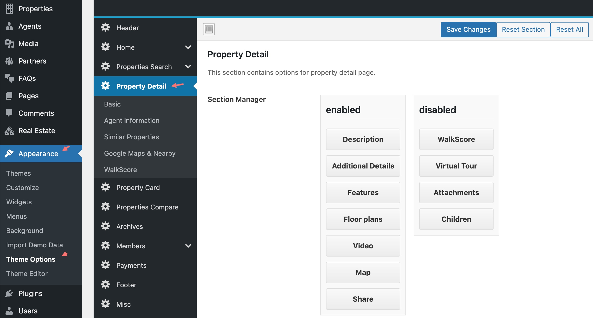
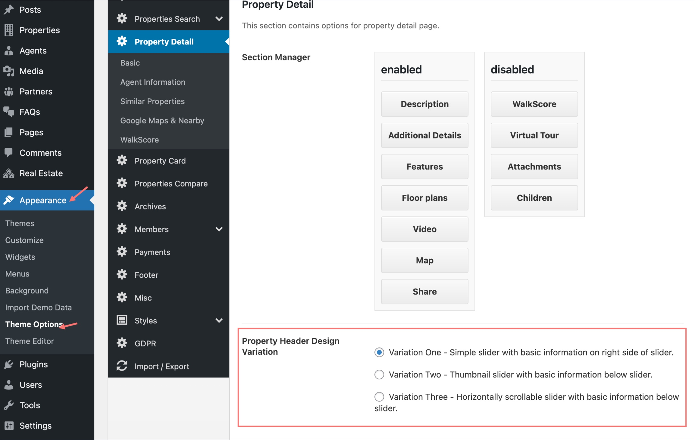
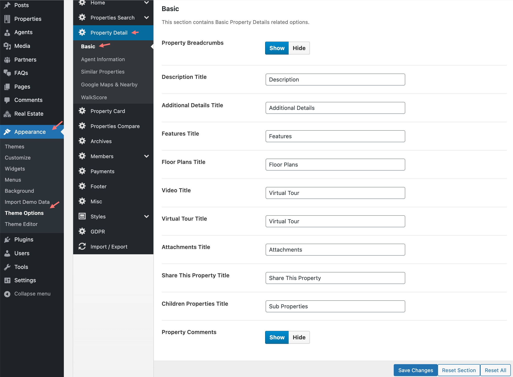
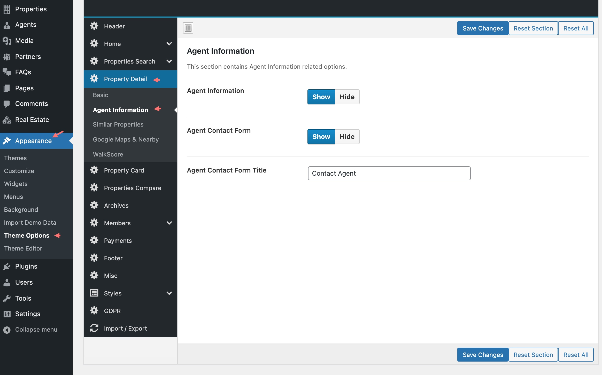
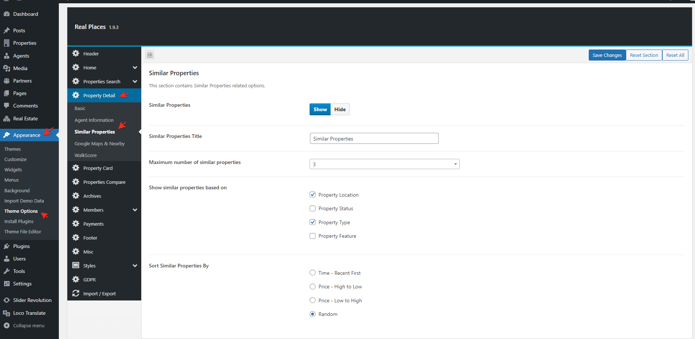
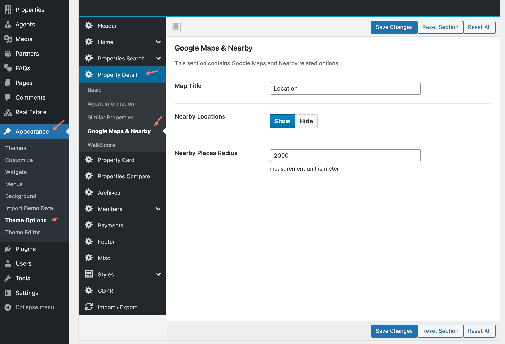
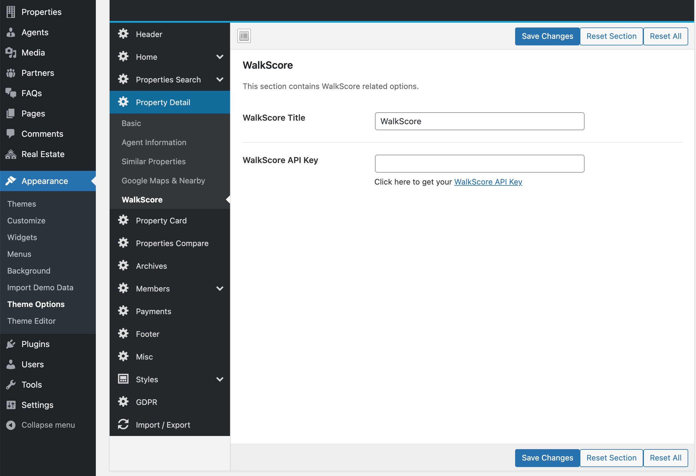

You can change the <strong>property detail page</strong> section order or disable any section using the following settings.

If you want to choose different header variation for your property detail page, you can do it as shown below

### General Settings

### Agent Settings

### Similar Properties Settings

### Google Maps & Nearby Settings
To configure **Nearby Places** you need to enable the [<strong>Google Maps Places API</strong>](https://developers.google.com/maps/documentation/javascript/places).

### WalkScore Settings

