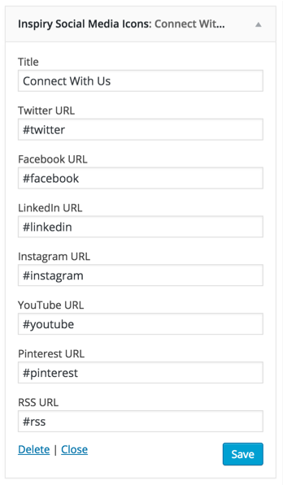

Go to <strong>Appearance</strong> &rarr; <strong>Widgets</strong> and look for <strong>Inspiry Social Media Icons </strong> widget.

Use this widget in a footer widget area and provide links for social icons that you want to display and leave others empty.

Now check out the front end of your site and you will have the <strong>Social Media Icons Widget</strong> working for your site.

