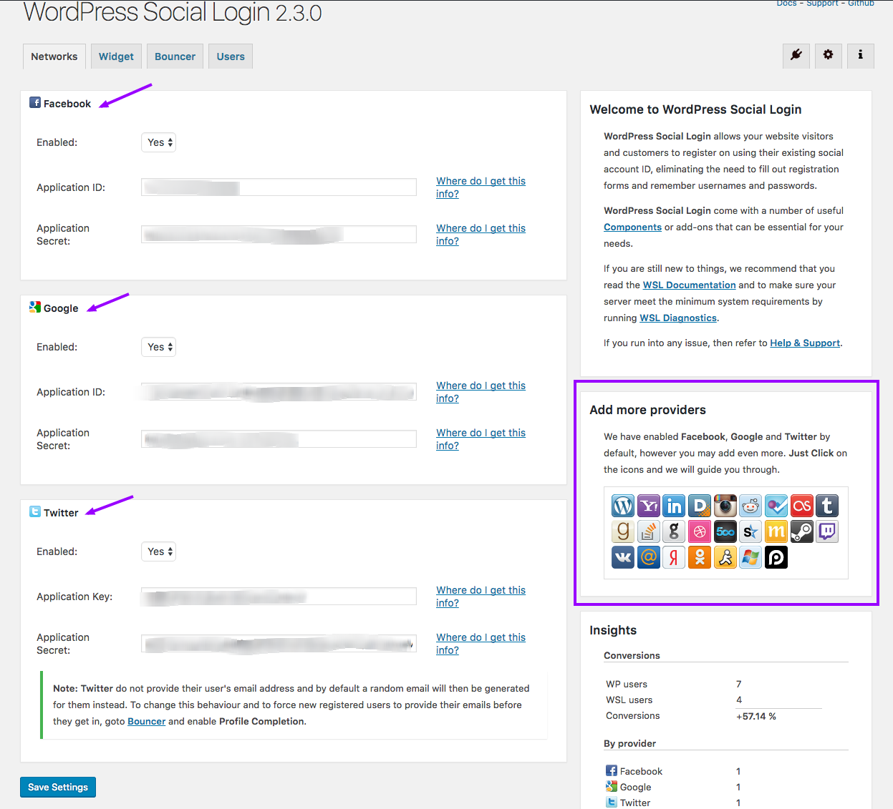

Install and Activate <strong><a target="_blank" href="https://wordpress.org/plugins/wordpress-social-login/">WordPress Social Login</a></strong> plugin.

After activation, Go to plugin settings and configure those for your desired social networks as displayed in screenshot below.

Also make sure to configure widget settings as recommended below.

Once configurations are done, You can check your login form and social login options will appear below it.

Feel free to get in touch with us using <a target="_blank" href="https://support.inspirythemes.com/ask-question/">our support website</a> in case of any confusion.
