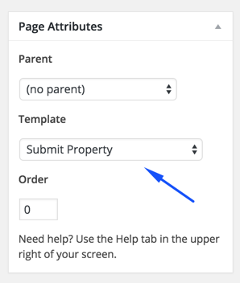
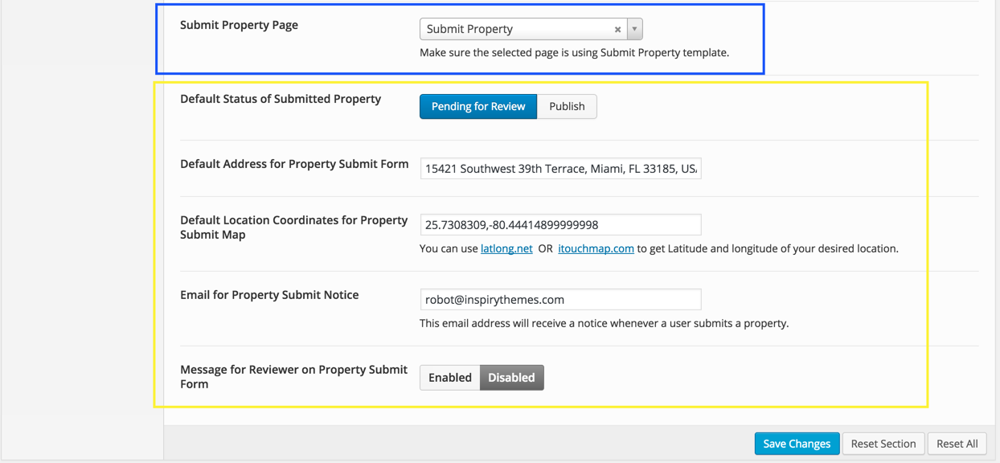
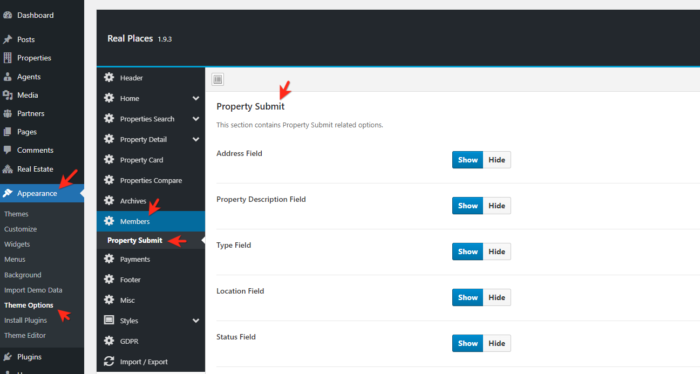

### Create Property Submit Page

In case of <strong>Demo Contents Import</strong> submit property page is already created and you do not need to create it but make sure to follow point 5 and 6 in this section.

To add submit property page, Go to <strong>Dashboard</strong> &rarr; <strong>Pages</strong> &rarr; <strong>Add New</strong>

Provide "<strong>Submit Property</strong>" as page title ( You can provide any page title you want )

Select <strong>Submit Property</strong> template from page attributes as displayed in the screen shot below.

<strong>Publish</strong> the page once you are done.

### Assign Property Submit Page in Theme Options

Now you need to go to <strong>Appearance</strong> &rarr; <strong>Theme Options</strong> &rarr; <strong>Members</strong> and choose the newly created page as submit property page. As displayed in blue box of the screen shot below. You can configure other settings related to this page using theme options marked by yellow box in the screen shot.

Save the changes in theme options and <strong>Submit Property</strong> page is ready for use.

### Enable/Disable Fields on Property Submit Page

You can enable or disable any field on the Property Submit Page using Theme Options. Navigate to **Dashboard &rarr; Appearance &rarr; Theme Options &rarr; Members &rarr; Property Submit**.

