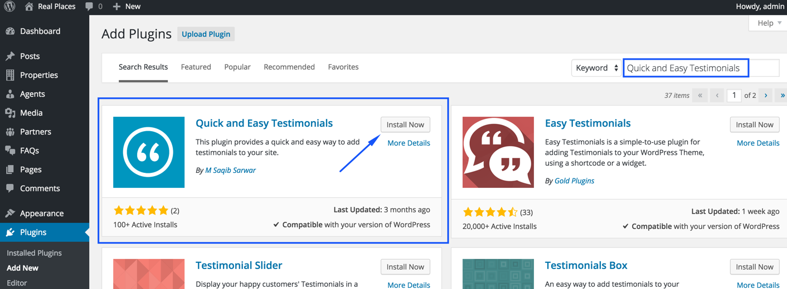
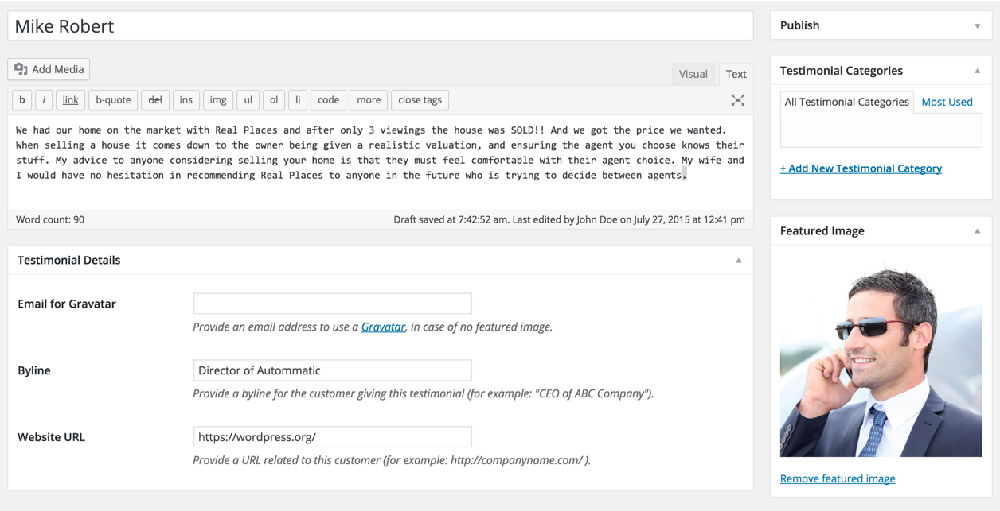
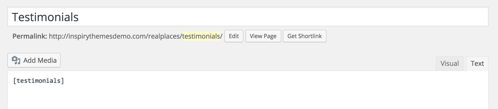

I have developed <a target="_blank" href="https://wordpress.org/plugins/quick-and-easy-testimonials/">Quick and Easy Testimonials</a> plugin for this purpose. Install the <a target="_blank" href="https://wordpress.org/plugins/quick-and-easy-testimonials/">Quick and Easy Testimonials</a> plugin. As guided in the screen shot below.

After installing and activating the plugin. You can add testimonials from <strong>Testimonials</strong> &rarr; <strong>Add New</strong> as displayed in the screen shot below.

Later on you can use following shortcodes to display testimonials on a page.

Display all testimonials. Shortcode <code>[testimonials]</code>
Display specific number of testimonials. Shortcode <code>[testimonials count="3"]</code>
Display only testimonials related to a category. Shortcode <code>[testimonials filter="category-slug"]</code>
Display single testimonial. Shortcode <code>[testimonials id="123"]</code>

Screen shot of a sample testimonials page is given below.

