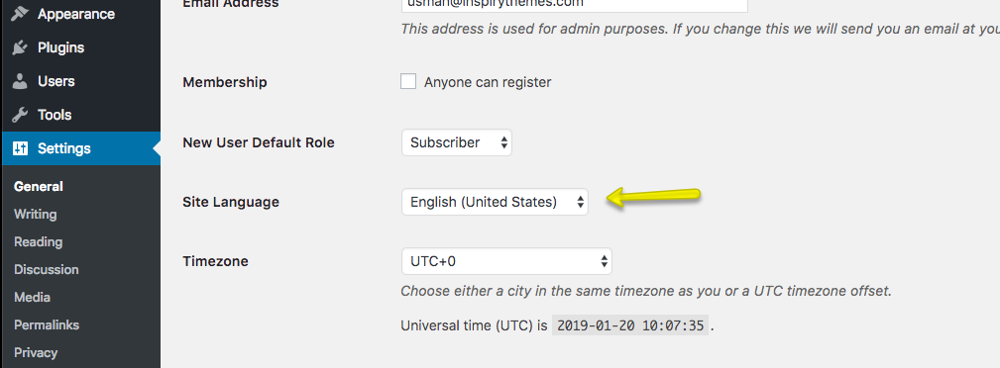

# Translation

### Language Packs

Real Places Theme comes with 6 Languages which are listed below.

- Spanish
- French
- Italian
- German
- Portuguese
- Turkish

### How to apply the available Language Packs

The **Available Translated languages** which are included can be applied very easily. Simply navigate to **Dashboard → Settings → General** and select any of the 6 available translated languages from **Site Language** drop down.

### Translating Real Homes Theme

Real Places Theme is fully translation ready.

To translate it to one language then please visit [This Knowledge Base Article](https://support.inspirythemes.com/knowledgebase/how-to-translate-your-theme-to-your-language/)

OR

You can also use [Loco Translate](https://wordpress.org/plugins/loco-translate/) Plugin by Tim Whitlockto translate this theme to your language or single language.

If you are planning to translate your website into multiple languages then [WPML Multilingual Plugin](https://wpml.org/) is the best option out there.