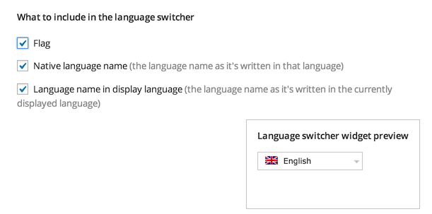
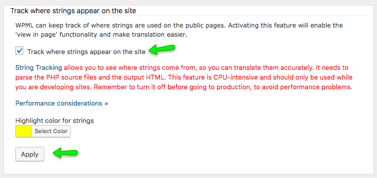

# WPML Basic Setup

> I am assuming that you have a working version of WordPress with Real Placestheme installed and configured based on the documenation and sample data provided with in the theme package.

Please follow the steps below to configure the basic settings for WPML Plugin.

1. Install and Activate **WPML Multilingual CMS Plugin**.

2. Upon activation it will display a notice at the top to configure WPML if you are activating it for the first time. Click on **Configure WPML**.

3. If you don't see the notice at the top then you can go to **Dashboard → WPML → Languages** to configure it.

4. Select **English** as **Current Language** and click **Next**.

5. Select the other languages for your site and click **Next**.

6. Leave all the section on this page as it is and click **Next**.

7. Select **Send theme and plugins info, in order to get faster support and compatibility alerts** and click **Next**.

8. Register WPML by adding in the **Site key** if you want to receive automatic updates OR press "**Remind Me Later**" button.

9. Click **Finish** Button, Now you will be taken to **Dashboard → WPML → Languages** page but with different interface. If not then manually go to **Dashboard → WPML → Languages Page**.

10. Look for **Language URL Format** section and choose **Different languages in directories**.

11. Look for **Language Switcher Options** section and then look for What to include in the language switcher option. Choose to display **Flag with in language switcher** and save the changes. Leave all other options as it is. 

12. Leave all other sections as it is.

13. Now, Install and activate **WPML String Translation plugin**. 

14. After that Go to **Dashboard → WPML → Theme and Plugin Localization**.

15. From **Localization options** which is “**How to translate strings in themes and plugins?**”, Choose **Translate themes and plugins using WPML's String Translation only (don't load .mo files)** and **Save**. 

16. Next Options is “**Strings in the Theme**”, Press the **Scan the theme for Strings** Button and Wait for results. 

17. Now, Go to **Dashboard → WPML → String Translation** section and configure the following settings. 

18.  Basic settings are complete and you can translate any string that does not exist in the post, pages and taxonomies via **Dashboard → WPML → String Translation** section. For more information consult: https://wpml.org/documentation/getting-started-guide/string-translation/
