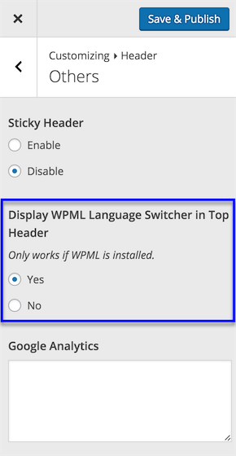
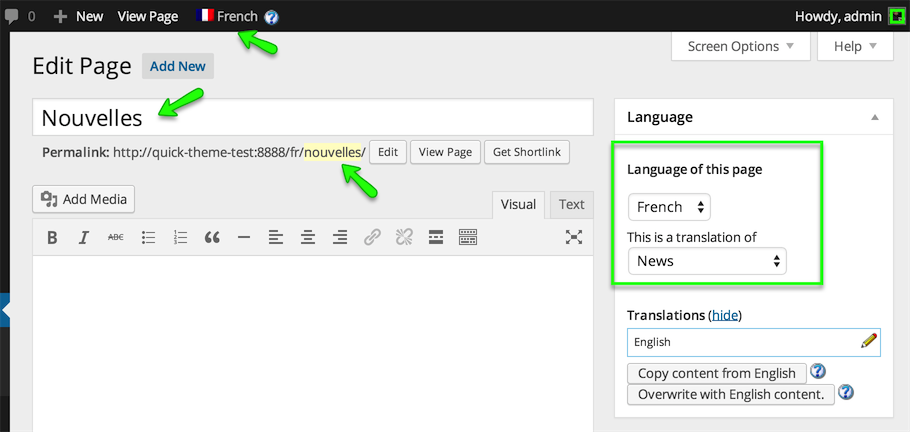
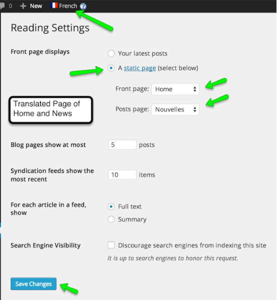

#Translate Home & News Page

### **Duplicate Home Page for Other Language**

1. Go to **Pages** on WordPress admin side and look for **Home Page**.

2. Open the **Home** page for editing and look for **Language** meta box in right sidebar.

3. Select Duplicate in front of your desired other language. and press **Duplicate** button. The page will refresh. 
!!! note
    You can edit the duplicated page if you need to but we are not doing it here.

4. Now you can go to the **Home** page on front end ( visit the site ) and choose the translated home page's language from language switcher in header top bar and you will see that page will refresh and URL will be changed to your newly translated homepage. 
!!! note
    If you are not able to view language switcher then make sure to enable the setting in **Dashboard → Appearance > Customize → Header → Others** section as displayed in screen shot below.

     

5. Do not worry about lots of un-translated things in header, footer and content area. You will learn to translate those one by one.

### **Duplicate News Page for Other Language**

1. Go to **Pages** on WordPress admin side and look for News Page

2. Duplicate it the same way we duplicated home page. ( As explained above )

3. Edit the duplicated news page and provide it translated title. As displayed below. 

4. Update the page after editing.

### **Update Reading Settings**

After creating Translated Pages for Home and news Go to **Dashboard → Settings → Reading** and configure the translated pages as **Front Page** and **Posts Page**. 

