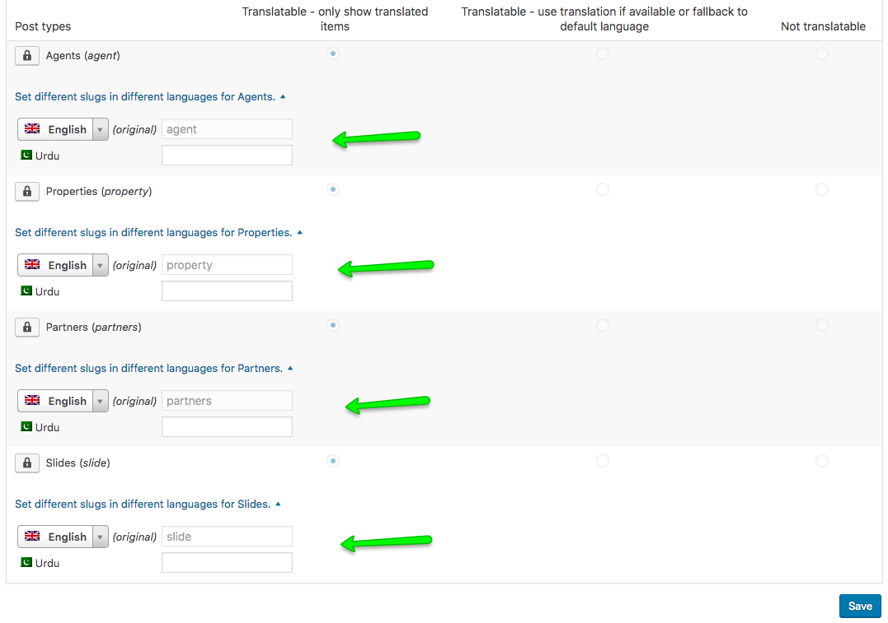

# Slugs Translation

### Custom Post Type Slug Translation

To translate the slugs of **Property**, **Partners** and other **Custom Post Types** navigate to **Dashboard → WPML → Settings** section and scroll down to find **Post Types Translation** section.

### Taxonomy Slug Translation

You can also translate slugs of any Taxonomy as well as Category in this very section.

