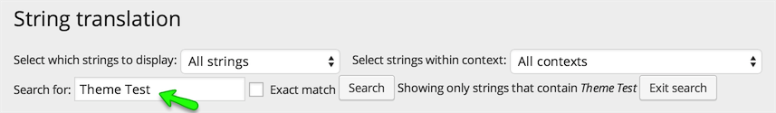
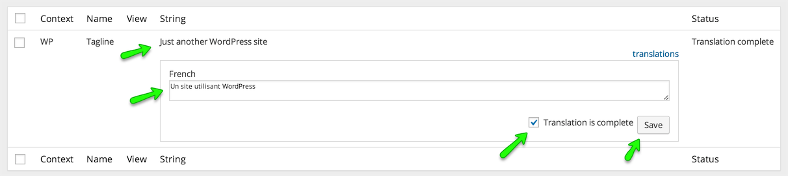
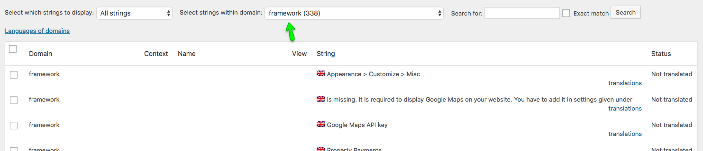

# String Translation

You can translate a string that does not exist in post, pages and taxonomies using **Dashboard → WPML → String Translation** section.

### String Translation Example

1. We will learn how to translate site name, Which is "**Theme Test**" for this example.

2. Go to **Dashboard → WPML → String Translation** section and search for "**Theme Test**". 

3. Once found, **Translate** it as displayed below. 

4. Translate the tag line using the same search. 

5. Now view the front end of your other language home page and you will have the site name and tag line translated.
 

6. So, You can translate all strings that are out of post's or page's content area.

### String Translation by Translation Domain

You can also choose a specific translation domain to precisely translate the strings attached to only that translation domain as shown below.

