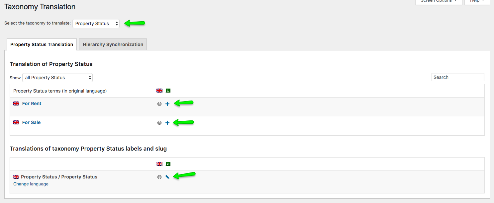
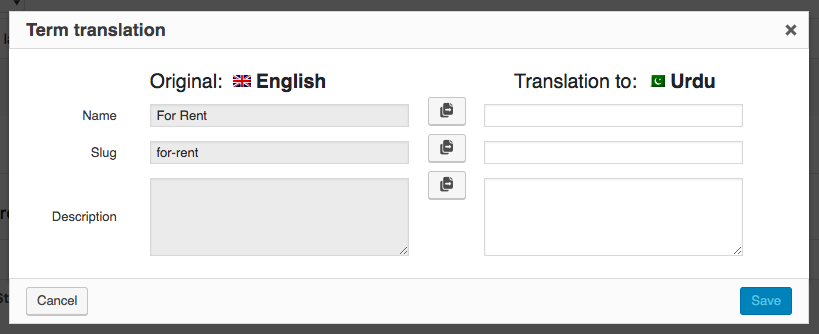
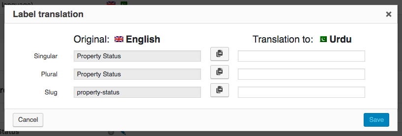

# Taxonomy Translation

To properly translate the taxonomies go to **Dashboard → WPML → Taxonomy Transaltion** section.

### Taxonomy Translation Example

1. We will see how to translate the taxonomy, Which is "**Property Status**" for this example.

2. In **Dashboard → WPML → Taxonomy Transaltion**, select the taxonomy which you want to translate from the dropdown at the top. Upon selection, you will see the options to translate each taxonomy. 

3. Upon clicking on the **Plus** icon, a popup will display to add translation for the primary and secondary languages side by side. 

4. To translate the slugs of the taxonomy, you need to click on the **Pencil** icon and another popup will appear to add translations for slug and labels for that taxonomy. 