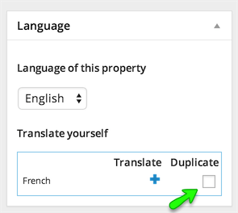
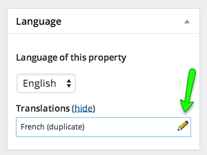

# Translate a Property

1. Go to **Dashboard → Properties** in WordPress admin side and start editing a property.

2. Look for language meta box in right sidebar, Check the duplicate checkbox and duplicate the property in other language . 

The page will refresh and property will be duplicate. 

Duplicating a property will save you from lots of hard work.

3. Now, Open the duplicated property for editing by clicking on pencil icon. 

4. On translated property's edit page, Go through all the fields one by one and provide the translated information.

5. In agent field you need to choose the translated agent ( You will not have any in start, But you can translate one easily using below given instructions ) 

!!! note
    Update the property that is currently being editing before moving ahead with agent's translation.

**To Translate an Agent:** Simply open an agent for editing and duplicate it into other language. Open the duplicated agent for editing and update the english information into translated information then update the agent. 

Refresh the translated property edit page, or re-open the translated property for editing and you will have the translated agent in agent field's select box.
